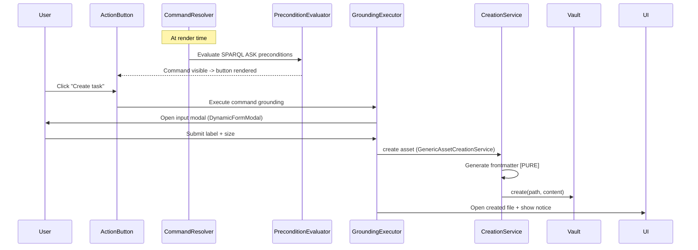
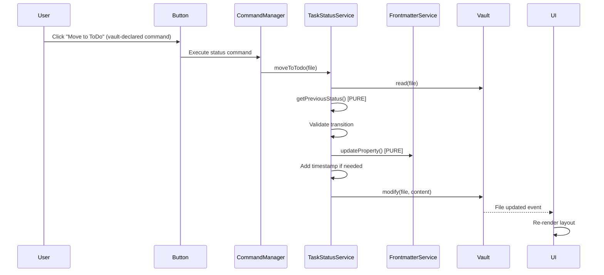
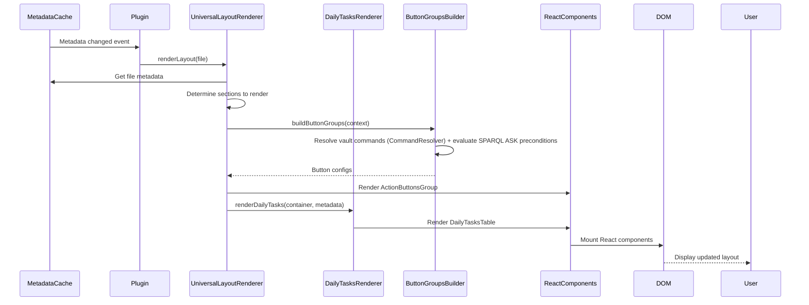
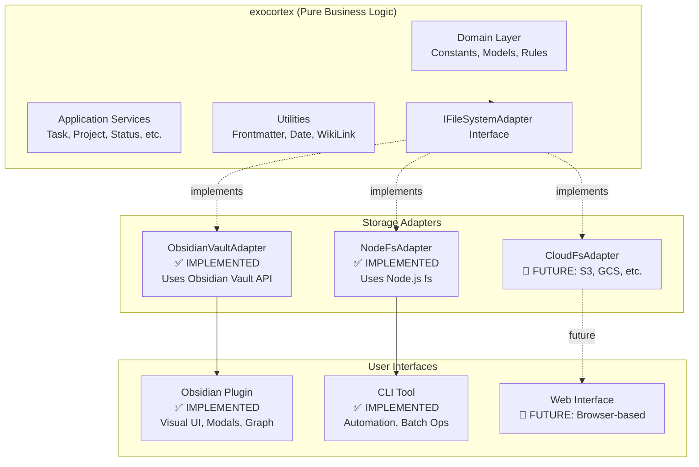

# Exocortex Architecture

**Version**: 16.74.x
**Last Updated**: 2026-06-10
**Status**: Monorepo v16.x (Clean Architecture + Vault-Driven)

---

## 📖 Table of Contents

1. [System Overview](#system-overview)
2. [Technology Stack](#technology-stack)
3. [Monorepo Organization](#monorepo-organization)
4. [Architecture Layers](#architecture-layers)
5. [Dependency Injection](#dependency-injection)
6. [Component Responsibilities](#component-responsibilities)
7. [Data Flow](#data-flow)
8. [Vault-Driven Architecture (RFC-011 + RFC-012)](#vault-driven-architecture-rfc-011--rfc-012)
9. [Profiles & AssetSpace Mounting](#profiles--assetspace-mounting)
10. [ExoSync](#exosync)
11. [Homoiconic Settings](#homoiconic-settings)
12. [Property Schema](#property-schema)
13. [Design Patterns](#design-patterns)
14. [Archgate — Executable ADR Governance](#archgate--executable-adr-governance)
15. [Error Handling](#error-handling)
16. [Current Architecture & State](#current-architecture--state-monorepo)

---

## 🎯 System Overview

### What is Exocortex?

Exocortex is a **knowledge management technology** that provides:

- **Asset management**: Tasks, projects, areas, concepts, prototypes
- **Status workflows**: Complete lifecycle (Draft → Backlog → Analysis → ToDo → Doing → Done)
- **Hierarchical organization**: Areas, projects, and task relationships
- **Time tracking**: Automatic timestamps for effort lifecycle
- **Priority voting**: Collaborative task prioritization
- **Knowledge graph**: Vault notes indexed as RDF triples, queryable via SPARQL/ExoQL

### Current Implementation

**Exocortex Obsidian Plugin** is the first adapter for Exocortex technology, providing a rich UI interface through Obsidian. It is **NOT** the core technology itself - just one interface to it.

**Key Insight**: All business logic (frontmatter generation, status transitions, property validation) is storage-agnostic and lives in the shared `exocortex` core package. The plugin and CLI are thin adapters around it (see the parity invariant below).

### UI/CLI Parity Invariant (enforced)

> The shared `exocortex` package contains all domain/engine logic behind platform-agnostic ports (`IFileSystemAdapter`, `IVaultAdapter`, `HttpClient`, etc.). The Obsidian plugin and CLI are **thin adapters** that inject platform-specific I/O (Obsidian Vault API vs Node `fs`/`fetch`). New user-facing capabilities must be implemented in the core first, then bound in **both** clients. Plugin-only or CLI-only implementations are invariant violations.

This is the architectural enforcement of Exocortex's no-lock-in north star: the product is the vault (data) plus the SDK (engine), and every client must be able to drive the full system. See [VISION.md](./VISION.md) for the full rationale and its complementary pairing with the Homoiconicity Invariant, and [docs/CROSS_RUNTIME_PARITY.md](./docs/explanation/CROSS_RUNTIME_PARITY.md) for a validator-specific enforcement example (a byte-identical-report parity test between the CLI and plugin runtimes).

---

## 🛠️ Technology Stack

### Core Technologies

```yaml
Language: TypeScript 5.9.3
Runtime: Obsidian Plugin API 1.5.0+
UI Framework: React 19.2.3
Build Tool: ESBuild 0.27.1
Package Manager: npm
```

### Testing Stack

```yaml
Unit Tests: Jest 30.2.0 + ts-jest
UI Tests: jest-environment-obsidian 0.0.1
Component Tests: Playwright CT 1.57.0
E2E Tests: Playwright 1.57.0 (Docker)
Coverage: Jest coverage (core: 95%, plugin: 75.5%, cli: 65%)
```

### Code Quality

```yaml
Linter: ESLint 9.38.0
  - typescript-eslint 8.49.0
  - eslint-plugin-obsidianmd 0.1.6 (official)
Formatter: Prettier 3.6.2
Pre-commit: Husky 9.1.7
Type Checking: TypeScript (noImplicitAny, strictNullChecks)
```

### Domain Technologies

```yaml
Data Format: YAML frontmatter + Markdown
Identifiers: UUID v4
Timestamps: ISO 8601 local time
References: WikiLinks ([[FileName]])
Graph View: Native Obsidian graph (label patch only — presentation/graph-view/GraphViewPatch.ts)
```

---

## 📦 Monorepo Organization

Exocortex is organized as a **monorepo** with five npm workspace packages plus two data submodules:

```
/packages
  /exocortex                  - exocortex (storage-agnostic core: domain, RDF/SPARQL engine, services)
  /obsidian-plugin            - @kitelev/exocortex-obsidian-plugin (Obsidian UI integration)
  /cli                        - @kitelev/exocortex-cli (command-line automation tool)
  /services                   - @kitelev/exocortex-services (shared grounding-service factories)
  /test-utils                 - @kitelev/exocortex-test-utils (shared test utilities and mock factories)
  /exoas-exo                  - data submodule (exo ontology assets; excluded from npm workspaces)
  /exoas-exocmd               - data submodule (exocmd command assets; excluded from npm workspaces)
```

**Benefits:**

- **Shared Core Logic**: Business logic in `exocortex` is reused by both plugin and CLI
- **Independent Versioning**: Each package has its own version and release cycle
- **Clear Boundaries**: Enforces separation between storage-agnostic logic and UI/CLI adapters
- **Parallel Development**: Teams can work on different packages independently

## 🏗️ Architecture Layers

Exocortex follows **Clean Architecture** principles with clear separation of concerns.

### Layer 1: Domain Layer (in exocortex)

**Purpose**: Core business entities, rules, and logic independent of any framework

**Location**: `packages/core/src/domain/`

**Components**:

- **Constants**: `AssetClass`, `EffortStatus` enums
- **Models**: `GraphNode`, `GraphData`, `AreaNode` interfaces
- **Commands**: `domain/commands/visibility/` — shared `CommandVisibilityContext` type and helper utilities only. The per-class `canX` visibility predicates were removed with the pre-homoiconic command layer (#3384); command visibility is now driven by vault-declared `exocmd__Command` preconditions (see [Vault-Driven Architecture](#vault-driven-architecture-rfc-011--rfc-012))
- **Profile**: `domain/profile/` — `TsFloorGuard` and profile apply-model domain logic
- **Errors / Layout / Types**: error hierarchy, layout models, shared types

**Dependencies**: ZERO external dependencies (pure TypeScript)

**Characteristics**:

- ✅ Pure functions only
- ✅ No framework imports
- ✅ Highly testable (100% unit testable)
- ✅ Reusable across adapters (CLI, Web, Mobile)

### Layer 2: Application Layer (in exocortex)

**Purpose**: Use cases and business services

**Location**: `packages/core/src/services/` (the bulk of core services) and `packages/core/src/application/` (error handling, layout resolution). The plugin-side facade `CommandManager` lives in `packages/obsidian-plugin/src/application/services/`.

**Components**:

- `CommandResolver` - Resolves commands from vault `exocmd/` assets with precondition evaluation
- `GroundingExecutor` - Executes grounding actions from command definitions
- `PreconditionEvaluator` - Evaluates SPARQL ASK preconditions for command visibility
- ~60 specialized service modules (asset creation, status workflows, RDF conversion, SHACL validation, profiles, sync, etc.) — see [Component Responsibilities](#component-responsibilities)

**Dependencies**: Domain layer, IFileSystemAdapter interface

**Characteristics**:

- Orchestrates domain logic
- Uses infrastructure interfaces (not concrete implementations)
- Framework-agnostic business workflows
- ✅ Fully testable without Obsidian

### Layer 3: Infrastructure Layer (split between packages)

**Purpose**: Implementation details and external integrations

**Core Infrastructure** (`packages/core/src/infrastructure/`):

- **IFileSystemAdapter**: Abstract interface for storage operations
- **Utilities**: Pure helpers (DateFormatter, WikiLinkHelpers, FrontmatterService)

**Obsidian Plugin Infrastructure** (`packages/obsidian-plugin/src/infrastructure/`):

- **ObsidianVaultAdapter**: Implements IFileSystemAdapter using Obsidian Vault API
- **Obsidian-specific utilities**: MetadataExtractor, cache management

**CLI Infrastructure** (`packages/cli/src/infrastructure/`):

- **NodeFsAdapter**: Implements IFileSystemAdapter using Node.js fs module
- **File system operations**: Direct file manipulation

**Dependencies**:

- Core: Zero external dependencies
- Plugin: Obsidian API (Vault, MetadataCache, TFile)
- CLI: Node.js fs, path modules

### Layer 4: Presentation Layer (in @kitelev/exocortex-obsidian-plugin)

**Purpose**: User interface and user interactions

**Location**: `packages/obsidian-plugin/src/presentation/`

**Components**:

- **Components**: React components in `presentation/components/` (ActionButtonsGroup, tables, trees, property editor/fields, SPARQL views)
- **Renderers**: Layout renderers in `presentation/renderers/` (Universal, DailyTasks, TableLayout, ExoLayout, Calendar, AreaTree/Relations)
- **Builders**: `presentation/builders/` (`ButtonGroupsBuilder` orchestrating the vault-driven `DynamicCommandButtonGroupBuilder`)
- **Modals**: Input dialogs in `presentation/modals/` (DynamicForm, DynamicAssetCreation, PropertyEditor, SPARQLQueryBuilder, etc.)

**Dependencies**: Obsidian API (App, Modal), React, exocortex

**Characteristics**:

- Obsidian-specific UI
- React state management
- Event handlers and user interactions
- Uses core services through dependency injection

---

## 🧩 Dependency Injection

### Overview

Exocortex uses **TSyringe** (Microsoft's lightweight DI container) for dependency injection across all packages. This enables clean architecture patterns, testability, and cross-platform support.

**Why TSyringe?**

- **Lightweight**: ~2KB bundle size (vs InversifyJS ~50KB)
- **Simple API**: Decorator-based with minimal boilerplate
- **TypeScript-native**: Full type safety with Symbol tokens
- **Cross-platform**: Works in both Obsidian (browser) and Node.js (CLI)

**Architecture Benefits:**

- **Separation of concerns**: Business logic independent of infrastructure
- **Testability**: Easy mocking of dependencies
- **Platform abstraction**: Same service works in Obsidian and CLI
- **Configuration flexibility**: Swap implementations without changing services

### Injectable Interfaces

All cross-cutting concerns are abstracted through interfaces in `exocortex`:

| Interface                | Purpose             | Obsidian Implementation                    | CLI Implementation                   |
| ------------------------ | ------------------- | ------------------------------------------ | ------------------------------------ |
| **ILogger**              | Structured logging  | `ObsidianLogger` (console)                 | `NodeLogger` (stdout)                |
| **IEventBus**            | Pub/sub messaging   | `ObsidianEventBus` (in-memory)             | `NodeEventBus` (in-memory)           |
| **IConfiguration**       | Settings management | `ObsidianConfiguration` (plugin data)      | `NodeConfiguration` (~/.exocortexrc) |
| **INotificationService** | User notifications  | `ObsidianNotificationService` (Notice API) | `NodeNotificationService` (console)  |
| **IVaultAdapter**        | File operations     | `ObsidianVaultAdapter` (Vault API)         | `NodeFsAdapter` (fs module)          |

**Interface Definitions:**

```typescript
// packages/core/src/interfaces/ILogger.ts
export interface ILogger {
  debug(message: string, context?: Record<string, any>): void;
  info(message: string, context?: Record<string, any>): void;
  warn(message: string, context?: Record<string, any>): void;
  error(message: string, error?: Error, context?: Record<string, any>): void;
}

// packages/core/src/interfaces/IEventBus.ts
export interface IEventBus {
  publish<T = any>(eventName: string, data: T): void;
  subscribe<T = any>(eventName: string, handler: (data: T) => void): () => void;
  unsubscribe(eventName: string, handler: (data: any) => void): void;
}

// packages/core/src/interfaces/IConfiguration.ts
export interface IConfiguration {
  get<T = any>(key: string): T | undefined;
  set<T = any>(key: string, value: T): Promise<void>;
  getAll(): Record<string, any>;
}

// packages/core/src/interfaces/INotificationService.ts
export interface INotificationService {
  info(message: string, duration?: number): void;
  success(message: string, duration?: number): void;
  error(message: string, duration?: number): void;
  warn(message: string, duration?: number): void;
  confirm(title: string, message: string): Promise<boolean>;
}
```

### DI Tokens (Type-Safe Injection)

Tokens are Symbol-based constants defined in `exocortex/interfaces/tokens.ts`:

```typescript
export const DI_TOKENS = {
  IFileSystemAdapter: Symbol.for("IFileSystemAdapter"),
  IVaultAdapter: Symbol.for("IVaultAdapter"),
  ILogger: Symbol.for("ILogger"),
  IEventBus: Symbol.for("IEventBus"),
  IConfiguration: Symbol.for("IConfiguration"),
  INotificationService: Symbol.for("INotificationService"),
} as const;

export type DIToken = (typeof DI_TOKENS)[keyof typeof DI_TOKENS];
```

**Why Symbols over strings?**

- **Type safety**: TypeScript checks prevent typos
- **No collisions**: Symbol.for() ensures global uniqueness
- **Refactoring-safe**: Rename interface, Symbol stays same
- **IntelliSense**: Autocomplete shows all available tokens

### Container Setup

#### Obsidian Plugin Container

**Location**: `packages/obsidian-plugin/src/infrastructure/di/PluginContainer.ts`

```typescript
import "reflect-metadata";
import { container } from "tsyringe";
import { DI_TOKENS } from "@kitelev/exocortex-core";
import { ObsidianLogger } from "./ObsidianLogger";
import { ObsidianEventBus } from "./ObsidianEventBus";
import { ObsidianConfiguration } from "./ObsidianConfiguration";
import { ObsidianNotificationService } from "./ObsidianNotificationService";
import { ObsidianVaultAdapter } from "../../adapters/ObsidianVaultAdapter";

export class PluginContainer {
  static setup(app: App, plugin: Plugin): void {
    // Register logger
    container.register(DI_TOKENS.ILogger, {
      useFactory: () => new ObsidianLogger(plugin),
    });

    // Register event bus
    container.register(DI_TOKENS.IEventBus, {
      useValue: new ObsidianEventBus(),
    });

    // Register configuration
    container.register(DI_TOKENS.IConfiguration, {
      useFactory: () => new ObsidianConfiguration(plugin),
    });

    // Register notification service
    container.register(DI_TOKENS.INotificationService, {
      useValue: new ObsidianNotificationService(),
    });

    // Register vault adapter
    container.register(DI_TOKENS.IVaultAdapter, {
      useFactory: () =>
        new ObsidianVaultAdapter(app.vault, app.metadataCache, app),
    });
  }

  static reset(): void {
    container.clearInstances();
  }
}
```

**Usage in Plugin**:

```typescript
// packages/obsidian-plugin/src/ExocortexPlugin.ts
import "reflect-metadata";
import { PluginContainer } from "./infrastructure/di/PluginContainer";

export default class ExocortexPlugin extends Plugin {
  async onload(): Promise<void> {
    // Initialize DI container (Phase 1 infrastructure)
    PluginContainer.setup(this.app, this);

    // ... rest of plugin initialization
  }
}
```

> **Note:** the CLI does **not** use a tsyringe container. Its composition
> root (`packages/cli/src/commands/apply.ts`) constructs its service graph by
> hand (`new CommandResolver(...)`, `new FileSystemVaultAdapter(...)`, …). The
> former `CLIContainer` + `Node*` adapter set was never wired into any command
> and was removed as dead code (Issue #3962). `reflect-metadata` is still
> imported at the CLI entry (`program.ts`) as the polyfill for the core
> package's `@injectable()`/`@inject()` decorators.

### Service Migration Pattern

**Migrating existing services to use DI:**

**Before (manual dependency passing):**

```typescript
export class PropertyCleanupService {
  constructor(private vault: IVaultAdapter) {}

  async cleanEmptyProperties(file: IFile): Promise<void> {
    const content = await this.vault.read(file);
    // ... implementation
  }
}

// Manual instantiation
const vaultAdapter = new ObsidianVaultAdapter(
  app.vault,
  app.metadataCache,
  app,
);
const service = new PropertyCleanupService(vaultAdapter);
```

**After (DI with @injectable and @inject):**

```typescript
import { injectable, inject } from "tsyringe";
import {
  DI_TOKENS,
  IVaultAdapter,
  ILogger,
  IFile,
} from "@kitelev/exocortex-core";

@injectable()
export class PropertyCleanupService {
  constructor(
    @inject(DI_TOKENS.IVaultAdapter) private vault: IVaultAdapter,
    @inject(DI_TOKENS.ILogger) private logger: ILogger,
  ) {
    this.logger.debug("PropertyCleanupService initialized");
  }

  async cleanEmptyProperties(file: IFile): Promise<void> {
    this.logger.debug("Cleaning empty properties", { path: file.path });
    const content = await this.vault.read(file);
    // ... implementation
    this.logger.info("Empty properties cleaned", { path: file.path });
  }
}

// Automatic resolution via container
const service = container.resolve(PropertyCleanupService);
```

**Migration Steps:**

1. Add `@injectable()` decorator to class
2. Add `@inject(DI_TOKENS.X)` to constructor parameters
3. Import dependencies from `exocortex`
4. Enable TypeScript decorators in `tsconfig.json`:
   ```json
   {
     "compilerOptions": {
       "experimentalDecorators": true,
       "emitDecoratorMetadata": true
     }
   }
   ```
5. Replace manual instantiation with `container.resolve(ServiceClass)`

### Testing with Dependency Injection

**Test Pattern: Mock Dependencies via Container**

```typescript
import "reflect-metadata";
import { container } from "tsyringe";
import {
  PropertyCleanupService,
  DI_TOKENS,
  IVaultAdapter,
  ILogger,
  IFile,
} from "@kitelev/exocortex-core";

describe("PropertyCleanupService with DI", () => {
  let mockVaultAdapter: jest.Mocked<IVaultAdapter>;
  let mockLogger: jest.Mocked<ILogger>;
  let service: PropertyCleanupService;

  beforeEach(() => {
    // Clear container before each test
    container.clearInstances();

    // Create mocks
    mockVaultAdapter = {
      read: jest.fn(),
      modify: jest.fn(),
      // ... other methods
    } as any;

    mockLogger = {
      debug: jest.fn(),
      info: jest.fn(),
      warn: jest.fn(),
      error: jest.fn(),
    };

    // Register mocks in container
    container.register(DI_TOKENS.IVaultAdapter, { useValue: mockVaultAdapter });
    container.register(DI_TOKENS.ILogger, { useValue: mockLogger });

    // Resolve service (automatically injects mocks)
    service = container.resolve(PropertyCleanupService);
  });

  afterEach(() => {
    container.clearInstances();
  });

  it("should use injected logger when cleaning properties", async () => {
    const mockFile: IFile = {
      path: "test.md",
      name: "test.md",
      basename: "test",
      extension: "md",
    };
    mockVaultAdapter.read.mockResolvedValue(
      "---\ntitle: Test\nemptyProp:\n---\nContent",
    );

    await service.cleanEmptyProperties(mockFile);

    expect(mockLogger.debug).toHaveBeenCalledWith("Cleaning empty properties", {
      path: "test.md",
    });
    expect(mockLogger.info).toHaveBeenCalledWith("Empty properties cleaned", {
      path: "test.md",
    });
  });

  it("should resolve service singleton from container", () => {
    const service1 = container.resolve(PropertyCleanupService);
    const service2 = container.resolve(PropertyCleanupService);

    expect(service1).toBe(service2); // Same instance
  });
});
```

**Key Testing Patterns:**

- ✅ Always `container.clearInstances()` in beforeEach/afterEach
- ✅ Register mocks before resolving service
- ✅ Verify injected dependencies are called correctly
- ✅ Test singleton behavior when needed
- ✅ Use `jest.Mocked<Interface>` for type-safe mocks

### Phase 1 Implementation Status

**✅ Completed:**

- TSyringe + reflect-metadata installed
- 4 core interfaces defined (ILogger, IEventBus, IConfiguration, INotificationService)
- Symbol-based DI_TOKENS created
- 4 Obsidian adapters implemented
- 4 CLI adapters implemented
- PluginContainer created
- TypeScript decorator support enabled
- PropertyCleanupService refactored as proof-of-concept
- DI initialization added to ExocortexPlugin.ts
- Unit tests for DI infrastructure (PluginContainer.test.ts)
- Unit tests for POC service (PropertyCleanupService.di.test.ts)

**📋 Future Phases (Not in Scope):**

- Phase 2: Migrate remaining services to DI
- Phase 3: Implement factory pattern for complex objects
- Phase 4: Add lifecycle management (scoped instances)
- Phase 5: Performance optimization (lazy loading)

---

## 🔧 Component Responsibilities

> The inventories below describe clusters rather than exhaustive per-file lists.
> For the authoritative, always-current inventory, list the referenced `src/`
> directories — per-file tables in docs drift quickly.

### Core Services (`packages/core/src/services/`)

Roughly 60 service modules, plus the `assetspace/`, `profile/`, and `sync/`
subdirectories. Main clusters:

| Cluster                            | Representative modules                                                                                                                                              |
| ---------------------------------- | ------------------------------------------------------------------------------------------------------------------------------------------------------------------- |
| **Vault-driven command machinery** | `CommandResolver`, `PreconditionEvaluator`, `GroundingExecutor`, `CommandExecutionFlow`, `WorkflowEngine`/`WorkflowResolver`                                        |
| **Asset creation**                 | `GenericAssetCreationService`, `AreaCreationService`, `ClassCreationService`, `ConceptCreationService`, `SupervisionCreationService`, `DynamicFrontmatterGenerator` |
| **Status & effort lifecycle**      | `EffortStatusWorkflow`, `TaskStatusService`, `StatusTimestampService`, `EffortVotingService`, `PlanningService`, `SessionEventService`                              |
| **RDF & schema resolution**        | `NoteToRDFConverter`, `PrototypeChainMaterializer`, `PropertySchemaResolver`, `InstantiationRuleResolver`, `IRICanonicalizer`, `SourceAnnotator`, `ClassHierarchy`  |
| **Validation (SHACL-lite)**        | `ShaclLiteValidator`, `ShapeLoader`, `ShapeRegistry`, `ValidatorDaemon`                                                                                             |
| **Maintenance & repair**           | `FolderRepairService`, `PropertyCleanupService`, `RenameToUidService`, `FixMissingLabelService`, `ArchiveAssetService`                                              |
| **Profiles & AssetSpaces**         | `services/profile/`, `services/assetspace/` (see [Profiles & AssetSpace Mounting](#profiles--assetspace-mounting))                                                  |
| **Sync**                           | `services/sync/` (see [ExoSync](#exosync))                                                                                                                          |

### Core Utilities (`packages/core/src/utilities/`)

Pure helpers shared by all clients: `FrontmatterService` (YAML
parsing/manipulation), `DateFormatter`, `WikiLinkHelpers`, `MetadataHelpers`,
`EffortSortingHelpers`, `FilenameValidator`, `extractAssetReference`, plus
`MetadataExtractor` (frontmatter extraction from cache shape).

### Renderers (`packages/obsidian-plugin/src/presentation/renderers/`)

`UniversalLayoutRenderer` (main layout coordinator), `DailyTasksRenderer`,
`TableLayoutRenderer`, `ExoLayoutRenderer`, `calendar/` (CalendarLayoutRenderer),
and `layout/` (AreaTreeRenderer, RelationsRenderer), with shared
`cell-renderers/` and `helpers/`. There is no Kanban renderer.

### Builders (`packages/obsidian-plugin/src/presentation/builders/`)

`ButtonGroupsBuilder` orchestrates `button-groups/DynamicCommandButtonGroupBuilder`,
which builds action buttons from vault command definitions.

> **Note**: As of RFC-011/012, the 5 hardcoded `ButtonGroupBuilder` implementations were replaced by a single universal `DynamicCommandButtonGroupBuilder` that reads command definitions from vault `exocmd/` assets.

### Components (`packages/obsidian-plugin/src/presentation/components/`)

Top-level React components: `ActionButtonsGroup` (single button-group host for
all vault-driven action buttons — there are no hardcoded per-command `*Button`
components), `AreaHierarchyTree`, `AssetRelationsTable`, `DailyTasksTable`,
`LayoutBlocks`, `ErrorBoundary`, `LayoutErrorFallback`.

Subdirectories group the rest by purpose:

| Directory                     | Purpose                                                           |
| ----------------------------- | ----------------------------------------------------------------- |
| `property-fields/`            | Inline field renderers per datatype + `PropertyFieldFactory`      |
| `property-editor/`            | React modal property editor (`PropertyEditorForm` + field set)    |
| `sparql/`                     | SPARQL query builder, result views (table/list/graph), error view |
| `dynamic-form/`               | Schema-driven dynamic form fields                                 |
| `daily-tasks/`, `properties/` | Specialized table and property-field components                   |

**Main UI components have Playwright CT tests** ✅

### Modals

`presentation/modals/`: `AddAssetSpaceModal`, `AreaSelectionModal`,
`BootstrapVaultModal`, `DynamicAssetCreationModal`, `DynamicFormModal`,
`PropertyEditorModal`, `SPARQLQueryBuilderModal`, `SimpleConfirmModal`.

Profile-related modals live in `infrastructure/adapters/`:
`ProfileFuzzyModal` (profile picker for _Apply profile_) and
`ClearSwitchCacheConfirmModal`.

---

## 🔄 Data Flow

### Asset Creation Flow



**Key Points**:

- Commands are vault assets (`exocmd__Command`); none are hardcoded
- Visibility is decided BEFORE rendering via SPARQL ASK preconditions
- Pure functions (frontmatter generation, file-content building) have zero dependencies
- The Vault write is the only Obsidian-specific step; MetadataCache updates automatically

### Status Change Flow



**Key Points**:

- Status validation is pure logic (workflow state machine)
- Timestamps added based on target status
- Frontmatter manipulation is pure function
- UI automatically re-renders on file change

### Layout Rendering Flow



**Key Points**:

- Triggered by metadata changes (Obsidian event system)
- Conditional section rendering based on asset class
- Button visibility determined by vault-declared preconditions (`PreconditionEvaluator`, SPARQL ASK)
- React components handle actual DOM rendering

---

## 🏗️ Vault-Driven Architecture (RFC-011 + RFC-012)

As of v15.44.0, Exocortex transitioned from a hardcoded architecture to a **vault-driven** model where commands, property schemas, prototype chains, and instantiation rules are all defined as vault assets rather than TypeScript code.

### Dynamic Command System

Commands live as vault assets in `exocmd/` with YAML frontmatter defining preconditions, input schemas, and grounding actions.

**Key services:**

| Service                            | Package         | Purpose                                                                                     |
| ---------------------------------- | --------------- | ------------------------------------------------------------------------------------------- |
| `CommandResolver`                  | exocortex       | Resolves available commands from vault `exocmd/` assets; evaluates SPARQL ASK preconditions |
| `PreconditionEvaluator`            | exocortex       | Compiled SPARQL ASK cache for fast command visibility checks (27 ASK queries < 50ms)        |
| `GroundingExecutor`                | exocortex       | Executes grounding actions (`create_instance`, `set_property`, `host_function`)             |
| `DynamicCommandButtonGroupBuilder` | obsidian-plugin | Single universal builder replacing 5 hardcoded ButtonGroupBuilders                          |

**Flow**: Vault asset (exocmd/) -> CommandResolver -> PreconditionEvaluator -> GroundingExecutor

### Prototype Chain Resolution

Prototypes define default properties that are inherited by instances. The `PrototypeChainMaterializer` resolves full prototype chains and materializes inherited triples into the RDF store.

**Key services:**

| Service                          | Package   | Purpose                                                                    |
| -------------------------------- | --------- | -------------------------------------------------------------------------- |
| `PrototypeChainMaterializer`     | exocortex | Walks `exo__Asset_prototype` chains, materializes inherited triples        |
| `NonInheritablePropertyRegistry` | exocortex | Registry of properties that must not be inherited (e.g., `exo__Asset_uid`) |

**Own vs. inherited distinction**: Hybrid named graphs annotate each triple's source. The `OWN()` ExoQL function filters to only own (non-inherited) properties.

### ExoQL (Query Language)

ExoQL is the public API for querying the Exocortex knowledge graph. It wraps SPARQL with Exocortex-specific extensions.

**Key components:**

| Component         | Package         | Purpose                                                                                           |
| ----------------- | --------------- | ------------------------------------------------------------------------------------------------- |
| `ExoQLParser`     | exocortex       | Parses ExoQL queries (`src/infrastructure/sparql/SPARQLParser.ts`)                                |
| `exoql/` module   | exocortex       | ExoQL evaluation extensions (`src/exoql/` — ExoEval allowlist validator, evaluation config)       |
| `OWN()` function  | exocortex       | Filter function that returns only own (non-inherited) properties                                  |
| Source annotation | exocortex       | Every triple is annotated with its origin (own, inherited, inferred)                              |
| ExoQL code block  | obsidian-plugin | `exoql` code block processor (alias of `sparql` block) for queries in vault notes                 |
| `query` command   | cli             | CLI query verb (the old `sparql` and `exoql` verbs were removed; see `packages/cli/src/index.ts`) |

### PropertySchemaResolver

Property schemas are now resolved from the triple store at runtime instead of being hardcoded in `PROPERTY_SCHEMAS` maps.

| Service                     | Package   | Purpose                                                                                     |
| --------------------------- | --------- | ------------------------------------------------------------------------------------------- |
| `PropertySchemaResolver`    | exocortex | Resolves property schemas (type, label, enum values) from RDF triples                       |
| `InstantiationRuleResolver` | exocortex | Resolves instance creation rules (which class, which properties, default values) from vault |

### What Was Removed

| Removed                                                        | Replaced By                                                                     |
| -------------------------------------------------------------- | ------------------------------------------------------------------------------- |
| 5 hardcoded `ButtonGroupBuilder` classes                       | 1 universal `DynamicCommandButtonGroupBuilder`                                  |
| Static command registrations in `CommandRegistry`              | Dynamic resolution via `CommandResolver`                                        |
| Hardcoded `PROPERTY_SCHEMAS` map                               | `PropertySchemaResolver` (triple store)                                         |
| Hardcoded `EFFORT_PROPERTY_MAP`                                | `InstantiationRuleResolver` (vault)                                             |
| Hardcoded `INSTANCE_CLASS_MAP`                                 | `InstantiationRuleResolver` (vault)                                             |
| 7 hardcoded label fallback implementations                     | SPARQL-based label template syntax                                              |
| 3-tier area fallback in `AssetMetadataService`                 | Prototype chain inheritance                                                     |
| Per-class `canX` visibility predicates (`*VisibilityRules.ts`) | Vault-declared `exocmd__Command` preconditions evaluated via SPARQL ASK (#3384) |

---

## 🗂️ Profiles & AssetSpace Mounting

`exo__Profile` is a vault-declared class that groups **AssetSpaces** (git-backed
asset repositories mounted under `assetspaces/`) for runtime materialization.
_Apply profile_ (`Cmd+P → Exocortex: Apply profile`, picker: `ProfileFuzzyModal`)
performs a **mount-state strict replace**: AssetSpaces in the profile's effective
set are materialized on disk, the rest are unmounted.

**Key pieces:**

- **Effective set** = declared `exo__Profile_includes` ∪ transitive
  `exo__Profile_imports` ∪ the **TS-floor**.
- **TS-floor guard** (`packages/core/src/domain/profile/TsFloorGuard.ts`):
  the always-mounted floor is **`{exo}`** (the SDK core); `exocmd` and
  `shared-identities` are optional. `assertTsFloor` **refuses** (throws
  `TsFloorViolationError`) rather than silently re-adding the floor — stripping
  `$exo` would self-brick the plugin (no class definitions, no commands).
- **`ProfileApplyManager`**
  (`packages/obsidian-plugin/src/infrastructure/adapters/ProfileApplyManager.ts`):
  coordinates the switch — persistent lock, journal entries, 2-phase commit
  (phase 1 materializes everything into staging and aborts on failure leaving the
  vault intact; phase 2 caches, verifies, destroys, and moves staging into place),
  and crash recovery on plugin load from the journal + `SwitchCacheLayer`.
- **Transports**: desktop uses git submodule operations (`GitSubmoduleOps`);
  mobile (no git binary) uses a REST/tarball path (`RestAssetSpaceMount`).
- **Per-device state** (`activeProfileUid`, `_switchInProgress`) lives in
  `data.local.json`, excluded from Obsidian Sync.
- **CLI parity**: `apply-profile` command (`CliApplyProfileService`).

See [docs/profile.md](docs/explanation/profile.md) for the full model.

---

## 🔁 ExoSync

ExoSync synchronizes vault AssetSpaces with their GitHub remotes without
requiring a git binary — portable to mobile.

- **Core engine** (`packages/core/src/services/sync/`): `SyncEngine`
  orchestrates pull/merge/push; `ChangeDetector` + `FileWatermarkStore` track
  local/remote drift; `StructuredMerger` performs frontmatter-aware 3-way
  merges (`diff3.ts`); `GatedStructuredMerger` + `MergeShaclGate` validate merge
  results against SHACL shapes before they land; `SyncedQuarantineStore`
  isolates conflicting/invalid results instead of corrupting the vault;
  `CredentialStore` and `secretScan` handle PAT storage and leak prevention;
  `transportBackoff` and `githubRepoReader` wrap the remote-read path.
- **Write path** (`packages/core/src/infrastructure/github/restCommit.ts`):
  transport-agnostic GitHub **Git Data API** 4-call chain (GET ref → POST trees →
  POST commits → PATCH ref, fast-forward only), shared by the plugin
  (`GitHubRestClient` over Obsidian `requestUrl`) and the CLI (Node `fetch`).

See [docs/exosync.md](docs/how-to/exosync.md) for the full design.

---

## ⚙️ Homoiconic Settings

Plugin settings follow the Homoiconicity Invariant: the schema of valid
settings lives in the graph as `exo__Setting` / `exo__SettingKey` assets
(shipped in the `packages/exoas-exo` data submodule), and setting values are
ordinary vault assets discovered by class — not hardcoded `data.json` keys.

- **`VaultSettingsRegistry`**
  (`packages/obsidian-plugin/src/domain/settings/VaultSettingsRegistry.ts`):
  allowlist-by-construction binding table between graph setting keys and
  `ExocortexSettings` TypeScript fields; a parity unit test keeps it in sync
  with the TBox. Per-device state, secrets, and structural settings are
  deliberately excluded and can never become vault assets.
- **`VaultSettingsStore`**
  (`packages/obsidian-plugin/src/infrastructure/adapters/VaultSettingsStore.ts`):
  loads setting assets from the vault, runs the one-shot migration from legacy
  `data.json` keys, and write-through persists settings-UI changes back to the
  vault assets.

See [docs/settings-homoiconization.md](docs/explanation/settings-homoiconization.md).

---

## 📋 Property Schema

### Naming Convention

**Format**: `[prefix]__[EntityType]_[propertyName]`

**Prefixes**:

- `exo__` - Universal Exocortex properties (all assets)
- `ems__` - Effort Management System (tasks, projects, meetings)
- `ims__` - Information Management System (concepts, knowledge)
- `pn__` - Personal Notes (daily notes, journals)
- `ztlk__` - Zettelkasten (note-taking system)

### Core Properties (All Assets)

| Property                 | Type           | Required | Format           | Purpose             |
| ------------------------ | -------------- | -------- | ---------------- | ------------------- |
| `exo__Asset_uid`         | String         | ✅ Yes   | UUID v4          | Unique identifier   |
| `exo__Asset_label`       | String         | ✅ Yes   | Free text        | Human-readable name |
| `exo__Asset_createdAt`   | String         | ✅ Yes   | ISO 8601         | Creation timestamp  |
| `exo__Asset_isDefinedBy` | String         | ✅ Yes   | WikiLink         | Ontology reference  |
| `exo__Instance_class`    | Array          | ✅ Yes   | WikiLink[]       | Asset type(s)       |
| `exo__Asset_isArchived`  | Boolean/String | No       | `true`, `"true"` | Archive status      |

### Effort Management Properties

| Property                            | Type   | Assets                 | Purpose                  |
| ----------------------------------- | ------ | ---------------------- | ------------------------ |
| `ems__Effort_status`                | String | Task, Project, Meeting | Current status           |
| `ems__Effort_area`                  | String | Task                   | Parent area reference    |
| `ems__Effort_parent`                | String | Task                   | Parent project reference |
| `exo__Asset_prototype`              | String | Task, Meeting          | Prototype template       |
| `ems__Effort_votes`                 | Number | Task, Project          | Priority vote count      |
| `ems__Effort_day`                   | String | Task, Project          | Planned day (WikiLink)   |
| `ems__Effort_startTimestamp`        | String | Task, Project          | When started (→ Doing)   |
| `ems__Effort_endTimestamp`          | String | Task, Project          | When ended (← Doing)     |
| `ems__Effort_resolutionTimestamp`   | String | Task, Project          | When completed (→ Done)  |
| `ems__Effort_plannedStartTimestamp` | String | Task, Project          | Planned start (evening)  |
| `ems__Task_size`                    | String | Task                   | Size estimate (S/M/L/XL) |
| `ems__Area_parent`                  | String | Area                   | Parent area reference    |

### Information Management Properties

| Property                  | Type   | Assets  | Purpose            |
| ------------------------- | ------ | ------- | ------------------ |
| `ims__Concept_broader`    | String | Concept | Parent concept     |
| `ims__Concept_definition` | String | Concept | Concept definition |

**See [PROPERTY_SCHEMA.md](docs/reference/PROPERTY_SCHEMA.md) for complete reference.**

---

## 🎨 Design Patterns

### 1. Repository Pattern

**Services act as repositories** for asset operations:

```typescript
// e.g. GenericAssetCreationService acts as an asset repository
interface IAssetRepository {
  create(source, metadata, label): Promise<TFile>;
  findByUid(uid): Promise<TFile | null>;
  update(file, changes): Promise<void>;
}
```

**Benefits**:

- Abstraction over storage (Vault)
- Testable with mocks
- Can swap implementations (File system, Cloud, Database)

### 2. Declarative Visibility (Vault-Declared Preconditions)

Command visibility used to be implemented as a Strategy-pattern layer of
per-class `canX` predicates (`TaskVisibilityRules.ts`, `EffortVisibilityRules.ts`,
etc.). That layer was **removed together with the pre-homoiconic command system
(#3384)**. `packages/core/src/domain/commands/visibility/` now retains only
the shared `CommandVisibilityContext` type and helper utilities.

Visibility is declared in the vault instead:

- Each `exocmd__Command` asset references precondition assets
  (`exocmd__Command_precondition`).
- A precondition is either a **SPARQL ASK** query
  (`exocmd__Precondition_sparqlAsk`) evaluated against the RDF store, or a
  registered **host function** (`exocmd__Precondition_hostFunction`) for checks
  that need platform context.
- `PreconditionEvaluator` (`packages/core/src/services/`) evaluates them at
  render time; `DynamicCommandButtonGroupBuilder` and the command-palette
  registrar only surface commands whose preconditions hold.

**Benefits**:

- New visibility rules are vault edits, not code changes
- One evaluation engine shared by UI buttons, command palette, and CLI
- Rules are data — inspectable and queryable like any other asset

### 3. Facade Pattern

**CommandManager is a facade** for command execution (`packages/obsidian-plugin/src/application/services/CommandManager.ts`), backed by `CommandResolver` for dynamic resolution:

```typescript
export class CommandManager {
  // Static registrations removed in RFC-011
  // Commands are now resolved dynamically from vault exocmd/ assets
  registerAllCommands(plugin, reloadCallback) {
    // CommandResolver discovers commands from vault
    // PreconditionEvaluator checks SPARQL ASK visibility
    // GroundingExecutor runs the command actions
  }
}
```

**Benefits**:

- Single entry point for command execution
- Commands defined in vault, not code
- Easy to add/modify commands without code changes
- Easy to mock for testing

### 4. Builder Pattern

**DynamicCommandButtonGroupBuilder constructs UI configurations from vault commands**:

```typescript
export class DynamicCommandButtonGroupBuilder {
  // Reads command definitions from vault exocmd/ assets
  // Uses CommandResolver to get available commands for current context
  // PreconditionEvaluator determines visibility via SPARQL ASK
  buildButtonGroups(
    file: TFile,
    context: CommandVisibilityContext,
    callbacks: ButtonCallbacks,
  ): ButtonGroup[] {
    // Commands resolved dynamically from vault, not hardcoded
    const commands = this.commandResolver.resolve(context);
    return commands.map((cmd) => ({
      id: cmd.id,
      label: cmd.label, // Supports SPARQL-based label templates
      onClick: () => this.groundingExecutor.execute(cmd, context),
    }));
  }
}
```

**Benefits**:

- Single universal builder replaces 5 hardcoded builders
- Command visibility driven by SPARQL preconditions
- Labels support dynamic templates
- New commands added by creating vault assets, not code

### 5. Observer Pattern

**Obsidian event system**:

```typescript
// In ExocortexPlugin
this.registerEvent(
  this.app.metadataCache.on("changed", (file) => {
    this.handleMetadataChange(file);
  }),
);
```

**Benefits**:

- Automatic UI updates on file changes
- Decoupled components
- Standard Obsidian pattern

### 6. Dependency Injection

Cross-cutting concerns are injected via a **TSyringe** container
(`PluginContainer.ts` in the plugin; the CLI hand-constructs its graph in
`apply.ts` instead); core
services depend on platform-agnostic interfaces (`IVaultAdapter`,
`IFileSystemAdapter`, `ILogger`, …) rather than Obsidian or Node APIs. See the
[Dependency Injection](#dependency-injection) section for details.

---

## 📊 Data Flow Examples

### Example 1: Creating Task from Area

**Step-by-Step**:

1. **User Action**: Opens Area note, clicks "Create Task" button (rendered because the command's SPARQL ASK precondition held)
2. **Modal Opens**: dynamic input modal asks for label + size
3. **User Input**: Enters "Review PR #123", size "M"
4. **Execution**: `GroundingExecutor` runs the command's grounding (asset creation)
5. **Frontmatter Generation** (PURE):
   ```typescript
   {
     exo__Asset_uid: "uuid-v4",
     exo__Asset_label: "Review PR #123",
     exo__Asset_createdAt: "2025-10-26T14:30:00",
     exo__Asset_isDefinedBy: '"[[Ontology/EMS]]"',  // Inherited
     exo__Instance_class: ['"[[ems__Task]]"'],
     ems__Effort_status: '"[[ems__EffortStatusDraft]]"',
     ems__Effort_area: '"[[Work]]"',  // From source Area
     ems__Task_size: "M",
     aliases: ["Review PR #123"]
   }
   ```
6. **File Creation**: `Vault.create("path/uuid.md", content)`
7. **Result**: New file opened in tab, notice shown

### Example 2: Voting on Effort

**Step-by-Step**:

1. **User Action**: Opens Task note, clicks "Vote" button (visible because the command's precondition held)
2. **Service Call**: `EffortVotingService.incrementEffortVotes(file)`
3. **Read Current Votes**:
   ```typescript
   extractVoteCount(content); // PURE function
   // Returns: 3 (current votes)
   ```
4. **Update Frontmatter** (PURE):
   ```typescript
   updateFrontmatterWithVotes(content, 4);
   // Returns: Updated content with ems__Effort_votes: 4
   ```
5. **Save**: `Vault.modify(file, updatedContent)`
6. **Result**: Vote count incremented, UI refreshes

### Example 3: Status Transition

**Step-by-Step**:

1. **User Action**: Opens Task (status: Backlog), clicks "Move to ToDo" (visible because the command's precondition held)
2. **Service Call**: `TaskStatusService.moveToTodo(file)`
3. **Workflow Validation** (PURE):
   ```typescript
   getPreviousStatusFromWorkflow("ToDo", "ems__Task");
   // Returns: "Analysis" (expected previous status)
   ```
4. **Update Status**:
   ```typescript
   ems__Effort_status: "[[ems__EffortStatusToDo]]";
   ```
5. **No Timestamp**: ToDo doesn't trigger timestamps
6. **Save**: `Vault.modify(file, updatedContent)`
7. **Result**: Status updated, layout re-renders

---

## 🛡️ Archgate — Executable ADR Governance

Exocortex enforces its architectural decisions automatically via [Archgate](https://github.com/nicholasgriffintn/archgate), a tool that turns ADRs into executable CI checks. Every pull request is validated against the project's recorded architectural constraints.

### How It Works

1. **Archgate rule specs** in `.archgate/adrs/` document each architectural decision (context, decision, consequences) and optionally pair a `.rules.ts` file containing automated checks.
2. The **`archgate check --ci`** command runs in the CI pipeline (`archgate` job in `.github/workflows/ci.yml`) and fails the build on any violation.

### Rule Tiers

| Tier                               | Prefix                    | Purpose                                        | Automated         | Examples                                                                              |
| ---------------------------------- | ------------------------- | ---------------------------------------------- | ----------------- | ------------------------------------------------------------------------------------- |
| **Tier 1 — Critical Constraints**  | `ARCH-*`, `SEC-*`         | Layer boundaries, security invariants          | Yes (`.rules.ts`) | `ARCH-008` (Clean Architecture layer deps), `SEC-001` (no `Math.random`, no MD5/SHA1) |
| **Tier 2 — Quality & Consistency** | `QUAL-*`                  | Code style, DI conventions                     | Yes (`.rules.ts`) | `QUAL-001` (injectable services, no console in core)                                  |
| **Documentation-only**             | `ARCH-*` (`rules: false`) | Record decisions without automated enforcement | No                | `ARCH-001` (UUID filenames)                                                           |

Rules with `rules: true` in their frontmatter have a sibling `.rules.ts` that Archgate executes. Rules with `rules: false` serve as reference documentation only.

### Directory Layout (illustrative excerpt)

```
.archgate/
├── adrs/                                     # full rule set lives here (ARCH-*, QUAL-*, SEC-*, DOC-*, ERROR-*, IMPORT-*, REACT-*)
│   ├── ARCH-001-uuid-filenames.md            # docs-only (rules: false)
│   ├── ARCH-002-property-naming.md           # has rules
│   ├── ARCH-002-property-naming.rules.ts
│   ├── ...
│   ├── SEC-001-cryptographic-security.md     # has rules
│   └── SEC-001-cryptographic-security.rules.ts
└── lint/
    └── README.md                             # linter plugin conventions
```

The listing above is an excerpt — see [`.archgate/adrs/`](.archgate/adrs/) for the authoritative, current rule set.

### CI Integration

The `archgate` job runs on every PR alongside unit and E2E tests:

```yaml
archgate:
  runs-on: ubuntu-latest
  timeout-minutes: 2
  steps:
    - uses: actions/checkout@v6
    - uses: actions/cache@v4
      with:
        path: ~/.archgate
        key: archgate-${{ runner.os }}
    - run: npm install -g archgate
    - run: archgate check --ci
```

### Adding a New Rule

1. **Create the Archgate spec** in `.archgate/adrs/<ID>-<slug>.md` with frontmatter (`id`, `title`, `domain`, `rules`, `files`) documenting the decision (context, decision, consequences).
2. **If automatable**, add a sibling `.rules.ts` that exports a `rules` object with `check(ctx)` functions. Archgate passes a context with `glob()`, `grep()`, and `report.violation()` helpers.
3. **Verify locally**: `npx archgate check` (or `archgate check` if installed globally).
4. **Push** — the CI `archgate` job validates the new rule automatically.

### Related Directories

- **Archgate rule specs + ADR records**: [`.archgate/adrs/`](.archgate/adrs/)
- **Linter plugin conventions**: [`.archgate/lint/`](.archgate/lint/)

---

## 🚨 Error Handling

Exocortex implements a **centralized error handling strategy** with structured error types, automatic retry logic, and telemetry hooks for monitoring.

### Error Class Hierarchy

**Base Class**: `ApplicationError` (abstract)

All application errors extend the base `ApplicationError` class, providing:

- **Standardized error codes** for categorization
- **Retry hint** for transient errors
- **User guidance** for actionable messages
- **Context object** for debugging
- **Timestamp** for when error occurred

```typescript
// packages/core/src/domain/errors/ApplicationError.ts
export abstract class ApplicationError extends Error {
  abstract readonly code: ErrorCode; // Standardized error code
  abstract readonly retriable: boolean; // Can operation be retried?
  abstract readonly guidance: string; // User-friendly help text
  readonly context?: Record<string, unknown>; // Debug info
  readonly timestamp: Date; // When error occurred

  format(): string; // Formats error for display
  toJSON(): Record<string, unknown>; // For logging/telemetry
}
```

### Error Types

| Error Type               | Code Range | Retriable | Use Case                                         |
| ------------------------ | ---------- | --------- | ------------------------------------------------ |
| `ValidationError`        | 1000-1999  | ❌ No     | Invalid input, missing fields, schema failures   |
| `NetworkError`           | 2000-2999  | ✅ Yes    | Network timeouts, connection failures, file I/O  |
| `StateTransitionError`   | 3000-3999  | ❌ No     | Invalid workflow transitions, state conflicts    |
| `PermissionError`        | 4000-4999  | ❌ No     | Access denied, unauthorized operations           |
| `NotFoundError`          | 5000-5999  | ❌ No     | Missing resources, files not found               |
| `ResourceExhaustedError` | 5000-5999  | ✅ Yes    | Quota exceeded, rate limiting                    |
| `ServiceError`           | 9000-9999  | ❌ No     | Internal service failures, initialization errors |

### Error Code Ranges

```typescript
// packages/core/src/domain/errors/ErrorCode.ts
enum ErrorCode {
  // Validation Errors (1000-1999)
  INVALID_INPUT = 1000,
  INVALID_FORMAT = 1001,
  MISSING_REQUIRED_FIELD = 1002,
  INVALID_SCHEMA = 1003,

  // Network/IO Errors (2000-2999)
  NETWORK_ERROR = 2000,
  REQUEST_TIMEOUT = 2001,
  CONNECTION_FAILED = 2002,
  FILE_READ_ERROR = 2003,
  FILE_WRITE_ERROR = 2004,

  // State/Logic Errors (3000-3999)
  INVALID_STATE = 3000,
  INVALID_TRANSITION = 3001,
  OPERATION_FAILED = 3002,
  CONCURRENT_MODIFICATION = 3003,

  // Permission/Access Errors (4000-4999)
  PERMISSION_DENIED = 4000,
  UNAUTHORIZED = 4001,
  FORBIDDEN = 4003,

  // Resource Errors (5000-5999)
  NOT_FOUND = 5000,
  RESOURCE_EXHAUSTED = 5001,
  ALREADY_EXISTS = 5002,

  // System/Unknown Errors (9000-9999)
  UNKNOWN_ERROR = 9000,
  INTERNAL_ERROR = 9001,
}
```

### ApplicationErrorHandler

The centralized error handler provides:

- **Error formatting** for display and logging
- **User notifications** via INotificationService
- **Automatic retry** with exponential backoff for retriable errors
- **Telemetry hooks** for monitoring and alerting

```typescript
// packages/core/src/application/errors/ApplicationErrorHandler.ts
export class ApplicationErrorHandler {
  constructor(
    retryConfig?: RetryConfig,
    logger?: ILogger,
    notifier?: INotificationService,
  );

  // Format error, notify user, call telemetry hooks
  handle(error: Error, context?: Record<string, unknown>): string;

  // Execute operation with automatic retry for retriable errors
  async executeWithRetry<T>(
    operation: () => Promise<T>,
    context?: Record<string, unknown>,
  ): Promise<T>;

  // Register/unregister telemetry hooks
  registerTelemetryHook(hook: ErrorTelemetryHook): void;
  unregisterTelemetryHook(hook: ErrorTelemetryHook): void;
}
```

### Retry Configuration

Default retry behavior uses **exponential backoff**:

| Parameter           | Default | Description                          |
| ------------------- | ------- | ------------------------------------ |
| `maxRetries`        | 3       | Maximum retry attempts               |
| `initialDelayMs`    | 1000    | Initial delay before first retry     |
| `backoffMultiplier` | 2       | Multiplier for each subsequent delay |
| `maxDelayMs`        | 10000   | Maximum delay between retries        |

**Delay sequence**: 1000ms → 2000ms → 4000ms → (capped at 10000ms)

```typescript
// Custom retry configuration example
const errorHandler = new ApplicationErrorHandler(
  {
    maxRetries: 5,
    initialDelayMs: 500,
    backoffMultiplier: 1.5,
    maxDelayMs: 5000,
  },
  logger,
  notifier,
);
```

### Service Integration Pattern

Services use `ApplicationErrorHandler.executeWithRetry()` for operations that may fail transiently:

```typescript
// Example: VaultRDFIndexer using executeWithRetry
export class VaultRDFIndexer {
  constructor(
    private converter: TripleConverter,
    private errorHandler: ApplicationErrorHandler,
  ) {}

  async initialize(): Promise<void> {
    const triples = await this.errorHandler.executeWithRetry(
      async () => this.converter.convertVault(),
      { context: "VaultRDFIndexer.initialize", operation: "convertVault" },
    );
    // ... process triples
  }

  async refresh(): Promise<void> {
    await this.errorHandler.executeWithRetry(async () => this.indexAllFiles(), {
      context: "VaultRDFIndexer.refresh",
      operation: "indexAllFiles",
    });
  }
}
```

### Telemetry Hooks

Monitor errors for alerting, analytics, or debugging:

```typescript
interface ErrorTelemetryHook {
  onError?(error: ApplicationError, context?: Record<string, unknown>): void;
  onRetry?(error: ApplicationError, attempt: number, delay: number): void;
  onRetryExhausted?(error: ApplicationError, totalAttempts: number): void;
}

// Example: Logging telemetry hook
const loggingHook: ErrorTelemetryHook = {
  onError: (error, context) => {
    console.error(`[ERROR] ${error.code}: ${error.message}`, context);
  },
  onRetry: (error, attempt, delay) => {
    console.warn(`[RETRY] Attempt ${attempt}, waiting ${delay}ms`);
  },
  onRetryExhausted: (error, totalAttempts) => {
    console.error(`[EXHAUSTED] Failed after ${totalAttempts} attempts`);
  },
};

errorHandler.registerTelemetryHook(loggingHook);
```

### Error Display

Errors are formatted with emoji indicators and structured guidance:

```
❌ ValidationError: Missing required field 'exo__Asset_label'

💡 Check the input data for correctness.
Common issues:
  • Missing required fields
  • Invalid data format or type
  • Values outside allowed range
  • Schema validation failed

📋 Context:
  file: "tasks/my-task.md"
  field: "exo__Asset_label"
```

### Best Practices

1. **Throw specific error types**: Use `ValidationError`, `NetworkError`, etc. instead of generic `Error`
2. **Include context**: Always provide debugging context when throwing errors
3. **Use executeWithRetry for I/O**: Wrap file and network operations in retry logic
4. **Register telemetry hooks**: Add monitoring for production deployments
5. **Don't catch and swallow**: Let errors propagate to the handler for proper logging

```typescript
// ✅ GOOD: Specific error with context
throw new ValidationError("Invalid status transition", {
  currentStatus: "Draft",
  targetStatus: "Done",
  allowedTransitions: ["Backlog"],
});

// ❌ BAD: Generic error without context
throw new Error("Invalid transition");
```

---

## 🔍 Current Architecture & State (Monorepo)

### 1. ✅ RESOLVED: Storage Abstraction

**Previous Problem**: Services directly used Obsidian `Vault`, `MetadataCache`, `TFile`

**Solution Implemented**:

- ✅ Extracted `exocortex` package with `IFileSystemAdapter` interface
- ✅ Created `ObsidianVaultAdapter` in plugin package
- ✅ Created `NodeFsAdapter` in CLI package
- ✅ Services now storage-agnostic

**Result**: Can run business logic without Obsidian, full testability

### 2. ✅ RESOLVED: Core Package Extraction

**Previous Problem**: Business logic mixed with UI code

**Solution Implemented**:

- ✅ Created `exocortex` package with pure business logic
- ✅ Zero external dependencies in core
- ✅ Shared by both plugin and CLI

**Result**: Single source of truth for business rules, no code duplication

### 3. ✅ RESOLVED: Command-Line Interface

**Previous Problem**: No automation without Obsidian running

**Solution Implemented**:

- ✅ Created `@kitelev/exocortex-cli` package
- ✅ Supports batch operations and automation
- ✅ Works with Claude Code and CI/CD

**Result**: Full automation capabilities for development workflows

### 4. Manual Property Management

**Problem**: Users must manually edit frontmatter for complex operations

**Impact**:

- Error-prone
- Steep learning curve
- Inconsistent formatting

**Solution**: More automated commands (ongoing)

### 5. Limited Multi-Vault Support

**Current state**:

- The **plugin** operates on a single Obsidian vault (Obsidian's model).
- The **CLI** supports multi-vault _reads_: `query` accepts a repeatable
  `--also <path>` option that adds extra vault paths to the query store
  (`packages/cli/src/commands/sparql-query.ts`).

**Remaining gap**: no cross-vault write operations or unified multi-vault index; future enhancement.

### Three-Tier Architecture (IMPLEMENTED)



### Achieved Benefits

**For Users**:

- ✅ CLI for automation (Claude Code integration)
- ✅ Faster development (parallel Core/Plugin work)
- ✅ More reliable (core enforces 95% Jest coverage thresholds; 700+ test files monorepo-wide)
- ✅ Batch operations without Obsidian running

**For Developers**:

- ✅ Testable core logic (no Obsidian mocks needed)
- ✅ Multiple UIs (Plugin, CLI, future Web)
- ✅ Clear dependency boundaries via npm workspaces
- ✅ Easier maintenance (one Core, multiple adapters)
- ✅ Independent package versioning

---

## 📚 Additional Resources

- [PROPERTY_SCHEMA.md](docs/reference/PROPERTY_SCHEMA.md) - Complete property reference
- [Diagrams](docs/diagrams/) - Architecture and flow diagrams
- [ADRs](.archgate/adrs/) - Architecture decision records
- [CLAUDE.md](CLAUDE.md) - Development guidelines
- [README.md](README.md) - User documentation

---

## 🔄 Revision History

| Version | Date       | Changes                                                                                                                                                              |
| ------- | ---------- | -------------------------------------------------------------------------------------------------------------------------------------------------------------------- |
| 1.0     | 2025-10-26 | Initial architecture documentation (pre-#122)                                                                                                                        |
| 1.1     | 2025-11-26 | Added Error Handling section (#438)                                                                                                                                  |
| 1.2     | 2025-11-29 | Documented CommandVisibility domain segregation (#468)                                                                                                               |
| 1.3     | 2026-02-19 | Updated to v15.0.1: tech stack versions, test counts (#2176)                                                                                                         |
| 2.0     | 2026-04-05 | RFC-011/012: vault-driven architecture, prototype chains, ExoQL, removed hardcoded builders (#2583)                                                                  |
| 2.1     | 2026-06-10 | Audit cleanup: visibility-rules layer removal (#3384), real package/component inventories, Profiles/ExoSync/homoiconic-settings sections, stale #122 framing removed |

---

**Maintainer**: @kitelev
