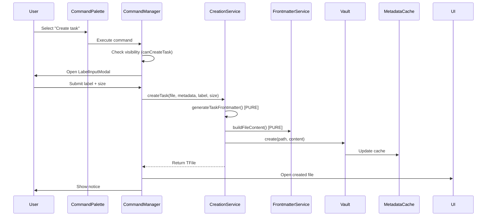
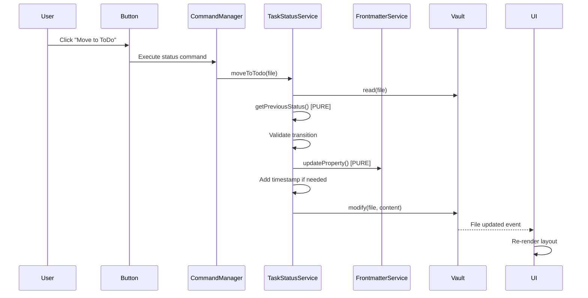
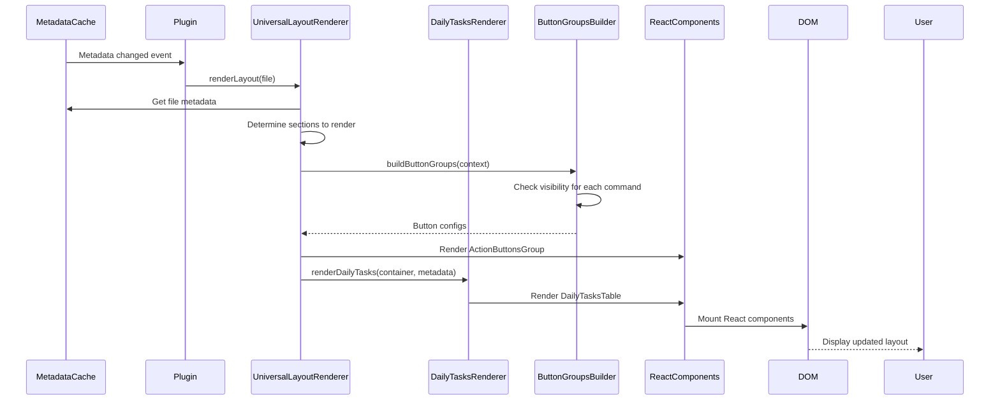
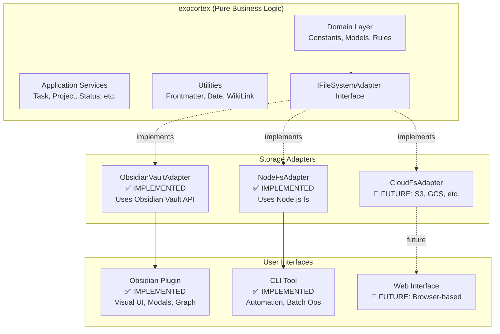

# Exocortex Architecture

**Version**: 15.44.0
**Last Updated**: 2026-04-05
**Status**: Monorepo v15.x (Clean Architecture + Vault-Driven)

---

## 📖 Table of Contents

1. [System Overview](#system-overview)
2. [Technology Stack](#technology-stack)
3. [Architecture Layers](#architecture-layers)
4. [Dependency Injection](#dependency-injection)
5. [Component Responsibilities](#component-responsibilities)
6. [Data Flow](#data-flow)
7. [Vault-Driven Architecture (RFC-011 + RFC-012)](#vault-driven-architecture-rfc-011--rfc-012)
8. [Property Schema](#property-schema)
9. [Design Patterns](#design-patterns)
10. [Archgate — Executable ADR Governance](#archgate--executable-adr-governance)
11. [Error Handling](#error-handling)
12. [Current Limitations](#current-limitations)
13. [Current Architecture](#current-architecture)

---

## 🎯 System Overview

### What is Exocortex?

Exocortex is a **knowledge management technology** that provides:
- **Asset management**: Tasks, projects, areas, concepts, prototypes
- **Status workflows**: Complete lifecycle (Draft → Backlog → Analysis → ToDo → Doing → Done)
- **Hierarchical organization**: Areas, projects, and task relationships
- **Time tracking**: Automatic timestamps for effort lifecycle
- **Priority voting**: Collaborative task prioritization
- **Knowledge graphs**: Visual representation of relationships

### Current Implementation

**Exocortex Obsidian Plugin** is the first adapter for Exocortex technology, providing a rich UI interface through Obsidian. It is **NOT** the core technology itself - just one interface to it.

**Key Insight**: All business logic (frontmatter generation, status transitions, property validation) should be storage-agnostic. The plugin currently mixes business logic with Obsidian-specific UI code, which will be refactored in Issue #122.

---

## 🛠️ Technology Stack

### Core Technologies

```yaml
Language: TypeScript 5.9.3
Runtime: Obsidian Plugin API 1.5.0+
UI Framework: React 19.2.3
Build Tool: ESBuild 0.27.1
Package Manager: npm
```

### Testing Stack

```yaml
Unit Tests: Jest 30.2.0 + ts-jest
UI Tests: jest-environment-obsidian 0.0.1
Component Tests: Playwright CT 1.57.0
E2E Tests: Playwright 1.57.0 (Docker)
Coverage: Jest coverage (core: 95%, plugin: 75.5%, cli: 65%)
BDD: Gherkin features (current: 80% coverage)
```

### Code Quality

```yaml
Linter: ESLint 9.38.0
  - typescript-eslint 8.49.0
  - eslint-plugin-obsidianmd 0.1.6 (official)
Formatter: Prettier 3.6.2
Pre-commit: Husky 9.1.7
Type Checking: TypeScript (noImplicitAny, strictNullChecks)
```

### Domain Technologies

```yaml
Data Format: YAML frontmatter + Markdown
Identifiers: UUID v4
Timestamps: ISO 8601 local time
References: WikiLinks ([[FileName]])
Graph: D3.js force-directed (force-graph 1.51.0)
```

---

## 📦 Monorepo Organization

Exocortex is organized as a **monorepo** with multiple npm workspaces:

```
/packages
  /exocortex                  - exocortex (storage-agnostic business logic)
  /obsidian-plugin            - @exocortex/obsidian-plugin (Obsidian UI integration)
  /cli                        - @kitelev/exocortex-cli (command-line automation tool)
  /test-utils                 - @exocortex/test-utils (shared test utilities and mock factories)
```

**Benefits:**
- **Shared Core Logic**: Business logic in `exocortex` is reused by both plugin and CLI
- **Independent Versioning**: Each package has its own version and release cycle
- **Clear Boundaries**: Enforces separation between storage-agnostic logic and UI/CLI adapters
- **Parallel Development**: Teams can work on different packages independently

## 🏗️ Architecture Layers

Exocortex follows **Clean Architecture** principles with clear separation of concerns.

### Layer 1: Domain Layer (in exocortex)

**Purpose**: Core business entities, rules, and logic independent of any framework

**Location**: `packages/exocortex/src/domain/`

**Components**:
- **Constants**: `AssetClass`, `EffortStatus` enums
- **Models**: `GraphNode`, `GraphData`, `AreaNode` interfaces
- **Commands**: Visibility rules (`CommandVisibility.ts`)
- **Settings**: Plugin configuration interfaces

**Dependencies**: ZERO external dependencies (pure TypeScript)

**Characteristics**:
- ✅ Pure functions only
- ✅ No framework imports
- ✅ Highly testable (100% unit testable)
- ✅ Reusable across adapters (CLI, Web, Mobile)

### Layer 2: Application Layer (in exocortex)

**Purpose**: Use cases and business services

**Location**: `packages/exocortex/src/application/services/`

**Components**:
- `CommandManager` - Facade for commands (static registrations removed; commands now resolved dynamically via `CommandResolver`)
- `CommandResolver` - Resolves commands from vault `exocmd/` assets with precondition evaluation
- `GroundingExecutor` - Executes grounding actions from command definitions
- `PreconditionEvaluator` - Evaluates SPARQL ASK preconditions for command visibility
- 35+ specialized services (TaskCreation, ProjectCreation, NLToSPARQL, Analytics, TrendDetection, CriticalityZone, SessionEvent, etc.)

**Dependencies**: Domain layer, IFileSystemAdapter interface

**Characteristics**:
- Orchestrates domain logic
- Uses infrastructure interfaces (not concrete implementations)
- Framework-agnostic business workflows
- ✅ Fully testable without Obsidian

### Layer 3: Infrastructure Layer (split between packages)

**Purpose**: Implementation details and external integrations

**Core Infrastructure** (`packages/exocortex/src/infrastructure/`):
- **IFileSystemAdapter**: Abstract interface for storage operations
- **Utilities**: Pure helpers (DateFormatter, WikiLinkHelpers, FrontmatterService)

**Obsidian Plugin Infrastructure** (`packages/obsidian-plugin/src/infrastructure/`):
- **ObsidianVaultAdapter**: Implements IFileSystemAdapter using Obsidian Vault API
- **Obsidian-specific utilities**: MetadataExtractor, cache management

**CLI Infrastructure** (`packages/cli/src/infrastructure/`):
- **NodeFsAdapter**: Implements IFileSystemAdapter using Node.js fs module
- **File system operations**: Direct file manipulation

**Dependencies**:
- Core: Zero external dependencies
- Plugin: Obsidian API (Vault, MetadataCache, TFile)
- CLI: Node.js fs, path modules

### Layer 4: Presentation Layer (in @exocortex/obsidian-plugin)

**Purpose**: User interface and user interactions

**Location**: `packages/obsidian-plugin/src/presentation/`

**Components**:
- **Components**: React components (24+ total, including ActionButtons, ArchiveTask, AreaHierarchyTree, PropertyEditor, SPARQL)
- **Renderers**: Layout renderers (6 total — DailyTasks, TableLayout, Universal, Calendar, Kanban, AreaTree)
- **Builders**: UI builders (`ButtonGroupsBuilder`, `CriticalityZoneButtonGroupBuilder`)
- **Modals**: Input dialogs (11 total, including SPARQLQueryBuilder, PropertyEditor, TrashReason)

**Dependencies**: Obsidian API (App, Modal), React, exocortex

**Characteristics**:
- Obsidian-specific UI
- React state management
- Event handlers and user interactions
- Uses core services through dependency injection

---

## 🧩 Dependency Injection

### Overview

Exocortex uses **TSyringe** (Microsoft's lightweight DI container) for dependency injection across all packages. This enables clean architecture patterns, testability, and cross-platform support.

**Why TSyringe?**
- **Lightweight**: ~2KB bundle size (vs InversifyJS ~50KB)
- **Simple API**: Decorator-based with minimal boilerplate
- **TypeScript-native**: Full type safety with Symbol tokens
- **Cross-platform**: Works in both Obsidian (browser) and Node.js (CLI)

**Architecture Benefits:**
- **Separation of concerns**: Business logic independent of infrastructure
- **Testability**: Easy mocking of dependencies
- **Platform abstraction**: Same service works in Obsidian and CLI
- **Configuration flexibility**: Swap implementations without changing services

### Injectable Interfaces

All cross-cutting concerns are abstracted through interfaces in `exocortex`:

| Interface | Purpose | Obsidian Implementation | CLI Implementation |
|-----------|---------|------------------------|-------------------|
| **ILogger** | Structured logging | `ObsidianLogger` (console) | `NodeLogger` (stdout) |
| **IEventBus** | Pub/sub messaging | `ObsidianEventBus` (in-memory) | `NodeEventBus` (in-memory) |
| **IConfiguration** | Settings management | `ObsidianConfiguration` (plugin data) | `NodeConfiguration` (~/.exocortexrc) |
| **INotificationService** | User notifications | `ObsidianNotificationService` (Notice API) | `NodeNotificationService` (console) |
| **IVaultAdapter** | File operations | `ObsidianVaultAdapter` (Vault API) | `NodeFileSystemAdapter` (fs module) |

**Interface Definitions:**
```typescript
// packages/exocortex/src/interfaces/ILogger.ts
export interface ILogger {
  debug(message: string, context?: Record<string, any>): void;
  info(message: string, context?: Record<string, any>): void;
  warn(message: string, context?: Record<string, any>): void;
  error(message: string, error?: Error, context?: Record<string, any>): void;
}

// packages/exocortex/src/interfaces/IEventBus.ts
export interface IEventBus {
  publish<T = any>(eventName: string, data: T): void;
  subscribe<T = any>(eventName: string, handler: (data: T) => void): () => void;
  unsubscribe(eventName: string, handler: (data: any) => void): void;
}

// packages/exocortex/src/interfaces/IConfiguration.ts
export interface IConfiguration {
  get<T = any>(key: string): T | undefined;
  set<T = any>(key: string, value: T): Promise<void>;
  getAll(): Record<string, any>;
}

// packages/exocortex/src/interfaces/INotificationService.ts
export interface INotificationService {
  info(message: string, duration?: number): void;
  success(message: string, duration?: number): void;
  error(message: string, duration?: number): void;
  warn(message: string, duration?: number): void;
  confirm(title: string, message: string): Promise<boolean>;
}
```

### DI Tokens (Type-Safe Injection)

Tokens are Symbol-based constants defined in `exocortex/interfaces/tokens.ts`:

```typescript
export const DI_TOKENS = {
  IFileSystemAdapter: Symbol.for("IFileSystemAdapter"),
  IVaultAdapter: Symbol.for("IVaultAdapter"),
  ILogger: Symbol.for("ILogger"),
  IEventBus: Symbol.for("IEventBus"),
  IConfiguration: Symbol.for("IConfiguration"),
  INotificationService: Symbol.for("INotificationService"),
} as const;

export type DIToken = typeof DI_TOKENS[keyof typeof DI_TOKENS];
```

**Why Symbols over strings?**
- **Type safety**: TypeScript checks prevent typos
- **No collisions**: Symbol.for() ensures global uniqueness
- **Refactoring-safe**: Rename interface, Symbol stays same
- **IntelliSense**: Autocomplete shows all available tokens

### Container Setup

#### Obsidian Plugin Container

**Location**: `packages/obsidian-plugin/src/infrastructure/di/PluginContainer.ts`

```typescript
import "reflect-metadata";
import { container } from "tsyringe";
import { DI_TOKENS } from "exocortex";
import { ObsidianLogger } from "./ObsidianLogger";
import { ObsidianEventBus } from "./ObsidianEventBus";
import { ObsidianConfiguration } from "./ObsidianConfiguration";
import { ObsidianNotificationService } from "./ObsidianNotificationService";
import { ObsidianVaultAdapter } from "../../adapters/ObsidianVaultAdapter";

export class PluginContainer {
  static setup(app: App, plugin: Plugin): void {
    // Register logger
    container.register(DI_TOKENS.ILogger, {
      useFactory: () => new ObsidianLogger(plugin),
    });

    // Register event bus
    container.register(DI_TOKENS.IEventBus, {
      useValue: new ObsidianEventBus(),
    });

    // Register configuration
    container.register(DI_TOKENS.IConfiguration, {
      useFactory: () => new ObsidianConfiguration(plugin),
    });

    // Register notification service
    container.register(DI_TOKENS.INotificationService, {
      useValue: new ObsidianNotificationService(),
    });

    // Register vault adapter
    container.register(DI_TOKENS.IVaultAdapter, {
      useFactory: () => new ObsidianVaultAdapter(app.vault, app.metadataCache, app),
    });
  }

  static reset(): void {
    container.clearInstances();
  }
}
```

**Usage in Plugin**:
```typescript
// packages/obsidian-plugin/src/ExocortexPlugin.ts
import "reflect-metadata";
import { PluginContainer } from "./infrastructure/di/PluginContainer";

export default class ExocortexPlugin extends Plugin {
  async onload(): Promise<void> {
    // Initialize DI container (Phase 1 infrastructure)
    PluginContainer.setup(this.app, this);

    // ... rest of plugin initialization
  }
}
```

#### CLI Container

**Location**: `packages/cli/src/infrastructure/di/CLIContainer.ts`

```typescript
import "reflect-metadata";
import { container } from "tsyringe";
import { DI_TOKENS } from "exocortex";
import { NodeLogger } from "./NodeLogger";
import { NodeEventBus } from "./NodeEventBus";
import { NodeConfiguration } from "./NodeConfiguration";
import { NodeNotificationService } from "./NodeNotificationService";

export class CLIContainer {
  static setup(): void {
    container.register(DI_TOKENS.ILogger, {
      useFactory: () => new NodeLogger("@exocortex/cli"),
    });

    container.register(DI_TOKENS.IEventBus, {
      useValue: new NodeEventBus(),
    });

    container.register(DI_TOKENS.IConfiguration, {
      useValue: new NodeConfiguration(),
    });

    container.register(DI_TOKENS.INotificationService, {
      useValue: new NodeNotificationService(),
    });
  }

  static reset(): void {
    container.clearInstances();
  }
}
```

### Service Migration Pattern

**Migrating existing services to use DI:**

**Before (manual dependency passing):**
```typescript
export class PropertyCleanupService {
  constructor(
    private vault: IVaultAdapter
  ) {}

  async cleanEmptyProperties(file: IFile): Promise<void> {
    const content = await this.vault.read(file);
    // ... implementation
  }
}

// Manual instantiation
const vaultAdapter = new ObsidianVaultAdapter(app.vault, app.metadataCache, app);
const service = new PropertyCleanupService(vaultAdapter);
```

**After (DI with @injectable and @inject):**
```typescript
import { injectable, inject } from "tsyringe";
import { DI_TOKENS, IVaultAdapter, ILogger, IFile } from "exocortex";

@injectable()
export class PropertyCleanupService {
  constructor(
    @inject(DI_TOKENS.IVaultAdapter) private vault: IVaultAdapter,
    @inject(DI_TOKENS.ILogger) private logger: ILogger
  ) {
    this.logger.debug("PropertyCleanupService initialized");
  }

  async cleanEmptyProperties(file: IFile): Promise<void> {
    this.logger.debug("Cleaning empty properties", { path: file.path });
    const content = await this.vault.read(file);
    // ... implementation
    this.logger.info("Empty properties cleaned", { path: file.path });
  }
}

// Automatic resolution via container
const service = container.resolve(PropertyCleanupService);
```

**Migration Steps:**
1. Add `@injectable()` decorator to class
2. Add `@inject(DI_TOKENS.X)` to constructor parameters
3. Import dependencies from `exocortex`
4. Enable TypeScript decorators in `tsconfig.json`:
   ```json
   {
     "compilerOptions": {
       "experimentalDecorators": true,
       "emitDecoratorMetadata": true
     }
   }
   ```
5. Replace manual instantiation with `container.resolve(ServiceClass)`

### Testing with Dependency Injection

**Test Pattern: Mock Dependencies via Container**

```typescript
import "reflect-metadata";
import { container } from "tsyringe";
import { PropertyCleanupService, DI_TOKENS, IVaultAdapter, ILogger, IFile } from "exocortex";

describe("PropertyCleanupService with DI", () => {
  let mockVaultAdapter: jest.Mocked<IVaultAdapter>;
  let mockLogger: jest.Mocked<ILogger>;
  let service: PropertyCleanupService;

  beforeEach(() => {
    // Clear container before each test
    container.clearInstances();

    // Create mocks
    mockVaultAdapter = {
      read: jest.fn(),
      modify: jest.fn(),
      // ... other methods
    } as any;

    mockLogger = {
      debug: jest.fn(),
      info: jest.fn(),
      warn: jest.fn(),
      error: jest.fn(),
    };

    // Register mocks in container
    container.register(DI_TOKENS.IVaultAdapter, { useValue: mockVaultAdapter });
    container.register(DI_TOKENS.ILogger, { useValue: mockLogger });

    // Resolve service (automatically injects mocks)
    service = container.resolve(PropertyCleanupService);
  });

  afterEach(() => {
    container.clearInstances();
  });

  it("should use injected logger when cleaning properties", async () => {
    const mockFile: IFile = { path: "test.md", name: "test.md", basename: "test", extension: "md" };
    mockVaultAdapter.read.mockResolvedValue("---\ntitle: Test\nemptyProp:\n---\nContent");

    await service.cleanEmptyProperties(mockFile);

    expect(mockLogger.debug).toHaveBeenCalledWith("Cleaning empty properties", { path: "test.md" });
    expect(mockLogger.info).toHaveBeenCalledWith("Empty properties cleaned", { path: "test.md" });
  });

  it("should resolve service singleton from container", () => {
    const service1 = container.resolve(PropertyCleanupService);
    const service2 = container.resolve(PropertyCleanupService);

    expect(service1).toBe(service2);  // Same instance
  });
});
```

**Key Testing Patterns:**
- ✅ Always `container.clearInstances()` in beforeEach/afterEach
- ✅ Register mocks before resolving service
- ✅ Verify injected dependencies are called correctly
- ✅ Test singleton behavior when needed
- ✅ Use `jest.Mocked<Interface>` for type-safe mocks

### Phase 1 Implementation Status

**✅ Completed:**
- TSyringe + reflect-metadata installed
- 4 core interfaces defined (ILogger, IEventBus, IConfiguration, INotificationService)
- Symbol-based DI_TOKENS created
- 4 Obsidian adapters implemented
- 4 CLI adapters implemented
- PluginContainer and CLIContainer created
- TypeScript decorator support enabled
- PropertyCleanupService refactored as proof-of-concept
- DI initialization added to ExocortexPlugin.ts
- Unit tests for DI infrastructure (PluginContainer.test.ts)
- Unit tests for POC service (PropertyCleanupService.di.test.ts)

**📋 Future Phases (Not in Scope):**
- Phase 2: Migrate remaining services to DI
- Phase 3: Implement factory pattern for complex objects
- Phase 4: Add lifecycle management (scoped instances)
- Phase 5: Performance optimization (lazy loading)

---

## 🔧 Component Responsibilities

### Services (25 Total)

| Service | Responsibility | LOC | Dependencies | Pure Logic % |
|---------|----------------|-----|--------------|--------------|
| **AlgorithmExtractor** | Extract H2 sections from markdown content | 32 | None | **100%** ✅ |
| **AreaCreationService** | Create child areas | 66 | Vault | 60% |
| **AreaHierarchyBuilder** | Build area hierarchy trees | 163 | Vault, MetadataCache | 50% |
| **AssetConversionService** | Convert between asset classes (Task↔Project) | 147 | Vault | 70% |
| **ClassCreationService** | Create subclasses in ontology | 76 | Vault | 60% |
| **ConceptCreationService** | Create narrower concepts | 69 | Vault | 70% |
| **DynamicFrontmatterGenerator** | Generate YAML frontmatter from property definitions | 363 | None | **100%** ✅ |
| **EffortStatusWorkflow** | Determine previous status in workflow | 66 | None | **100%** ✅ |
| **EffortVotingService** | Increment effort vote counts | 103 | Vault | 80% |
| **FleetingNoteCreationService** | Create fleeting note assets in inbox | 57 | Vault | 70% |
| **FolderRepairService** | Move files to expected folders | 118 | Vault, MetadataCache | 10% |
| **LabelToAliasService** | Copy labels to aliases array | 74 | Vault | 70% |
| **LoggingService** | Centralized logging with debug/info/warn/error | 29 | None | **100%** ✅ |
| **NoteToRDFConverter** | Convert Obsidian notes to RDF triples | 323 | Vault | 60% |
| **PlanningService** | Set plannedStartTimestamp on tasks | 37 | Vault | 70% |
| **ProjectCreationService** | Create projects from areas/initiatives | 86 | Vault | 60% |
| **PropertyCleanupService** | Remove empty properties from frontmatter | 144 | Vault | 80% |
| **RenameToUidService** | Rename files to UID format | 93 | App.fileManager | 0% |
| **SessionEventService** | Track focus session start/end events | 116 | Vault | 60% |
| **StatusTimestampService** | Manage start/end/resolution timestamps | 153 | Vault | 70% |
| **SupervisionCreationService** | Create CBT supervision notes | 76 | Vault | 80% |
| **TaskCreationService** | Create tasks from areas/projects/prototypes | 186 | Vault | 60% |
| **TaskFrontmatterGenerator** | Generate frontmatter for new tasks | 125 | None | **100%** ✅ |
| **TaskStatusService** | Manage effort status transitions | 290 | Vault | 70% |
| **URIConstructionService** | Construct URIs for assets | 111 | FileSystem | 50% |

**Total Lines**: ~3,103 (services only)

### Utilities (6 Total)

| Utility | Purpose | LOC | Obsidian Deps | Type |
|---------|---------|-----|---------------|------|
| **FrontmatterService** | YAML parsing/manipulation | 303 | None | Pure ✅ |
| **DateFormatter** | Date formatting (ISO 8601, WikiLinks) | 89 | None | Pure ✅ |
| **WikiLinkHelpers** | Normalize [[WikiLinks]] | 54 | None | Pure ✅ |
| **MetadataHelpers** | Metadata operations | 142 | None | Pure ✅ |
| **EffortSortingHelpers** | Sort efforts by priority | 76 | None | Pure ✅ |
| **MetadataExtractor** | Extract frontmatter from cache | 165 | MetadataCache | Partial |

**Total Lines**: ~829

**Note**: 5 out of 6 utilities are pure functions (100% testable, 100% reusable).

### Renderers (3 Total)

| Renderer | Purpose | LOC | Type |
|----------|---------|-----|------|
| **UniversalLayoutRenderer** | Main layout coordinator | 816 | Complex |
| **DailyTasksRenderer** | Render daily tasks section | 463 | Complex |
| **DailyProjectsRenderer** | Render daily projects section | 227 | Complex |

### Builders (1 Total)

| Builder | Purpose | LOC | Type |
|---------|---------|-----|------|
| **DynamicCommandButtonGroupBuilder** | Build action buttons from vault command definitions | ~200 | Vault-Driven |

> **Note**: As of RFC-011/012, the 5 hardcoded `ButtonGroupBuilder` implementations were replaced by a single universal `DynamicCommandButtonGroupBuilder` that reads command definitions from vault `exocmd/` assets.

### Components (58 Total)

The presentation layer contains **58 component files** organized by purpose:

#### Main UI Components (25 files)

Core tables, trees, and action buttons:

| Category | Components |
|----------|------------|
| **Tables** (4) | `DailyTasksTable`, `DailyProjectsTable`, `AssetPropertiesTable`, `AssetRelationsTable` |
| **Trees** (1) | `AreaHierarchyTree` |
| **Button Groups** (1) | `ActionButtonsGroup` |
| **Action Buttons** (18) | `CreateTaskButton`, `CreateInstanceButton`, `CreateProjectButton`, `StartEffortButton`, `MarkTaskDoneButton`, `PlanOnTodayButton`, `VoteOnEffortButton`, `ArchiveTaskButton`, `TrashEffortButton`, `RollbackStatusButton`, `MoveToToDoButton`, `MoveToBacklogButton`, `MoveToAnalysisButton`, `ShiftDayForwardButton`, `ShiftDayBackwardButton`, `CleanEmptyPropertiesButton`, `RenameToUidButton`, `RepairFolderButton` |
| **Utilities** (1) | `ErrorBoundary` |

#### Property Fields (14 files in `property-fields/`)

Non-React field renderers for inline property editing:

| Type | Files |
|------|-------|
| **Field Types** (12) | `TextPropertyField`, `NumberPropertyField`, `BooleanPropertyField`, `DatePropertyField`, `DateTimePropertyField`, `TimestampPropertyField`, `EnumPropertyField`, `ReferencePropertyField`, `SizeSelectPropertyField`, `StatusSelectPropertyField`, `WikilinkPropertyField`, `PropertyFieldFactory` |
| **Infrastructure** (2) | `index.ts`, `types.ts` |

#### Property Editor (8 files in `property-editor/`)

React-based modal property editor:

| Type | Files |
|------|-------|
| **Form** (1) | `PropertyEditorForm` |
| **Field Components** (6) | `TextField`, `NumberField`, `BooleanField`, `SelectField`, `TimestampField`, `WikiLinkField` |
| **Infrastructure** (1) | `fields/index.ts` |

#### SPARQL Components (9 files in `sparql/`)

SPARQL query interface and result visualization:

| Type | Files |
|------|-------|
| **Query Builder** (2) | `QueryBuilder`, `QueryTemplates` |
| **Result Views** (5) | `SPARQLResultViewer`, `SPARQLTableView`, `SPARQLListView`, `SPARQLGraphView`, `SPARQLEmptyState` |
| **Error Handling** (1) | `SPARQLErrorView` |
| **Controls** (1) | `ViewModeSelector` |

#### Properties (2 files in `properties/`)

Specialized property field components:

- `DateTimePropertyField.tsx`
- `TextPropertyField.tsx`

**Main UI components have Playwright CT tests** ✅

### Modals (6 Total)

- `LabelInputModal.ts` - Task/project label + size input
- `NarrowerConceptModal.ts` - Concept creation form
- `SupervisionInputModal.ts` - CBT supervision form
- `AreaLabelInputModal.ts` - Area label input
- Plus standard Obsidian modals

---

## 🔄 Data Flow

### Asset Creation Flow



**Key Points**:
- Visibility check happens BEFORE modal opens
- Pure functions (`generateTaskFrontmatter`, `buildFileContent`) have zero dependencies
- Vault operation is the only Obsidian-specific step
- MetadataCache updates automatically

### Status Change Flow



**Key Points**:
- Status validation is pure logic (workflow state machine)
- Timestamps added based on target status
- Frontmatter manipulation is pure function
- UI automatically re-renders on file change

### Layout Rendering Flow



**Key Points**:
- Triggered by metadata changes (Obsidian event system)
- Conditional section rendering based on asset class
- Button visibility determined by CommandVisibility pure functions
- React components handle actual DOM rendering

---

## 🏗️ Vault-Driven Architecture (RFC-011 + RFC-012)

As of v15.44.0, Exocortex transitioned from a hardcoded architecture to a **vault-driven** model where commands, property schemas, prototype chains, and instantiation rules are all defined as vault assets rather than TypeScript code.

### Dynamic Command System

Commands live as vault assets in `exocmd/` with YAML frontmatter defining preconditions, input schemas, and grounding actions.

**Key services:**

| Service | Package | Purpose |
|---------|---------|---------|
| `CommandResolver` | exocortex | Resolves available commands from vault `exocmd/` assets; evaluates SPARQL ASK preconditions |
| `PreconditionEvaluator` | exocortex | Compiled SPARQL ASK cache for fast command visibility checks (27 ASK queries < 50ms) |
| `GroundingExecutor` | exocortex | Executes grounding actions (`create_instance`, `set_property`, `host_function`) |
| `DynamicCommandButtonGroupBuilder` | obsidian-plugin | Single universal builder replacing 5 hardcoded ButtonGroupBuilders |

**Flow**: Vault asset (exocmd/) -> CommandResolver -> PreconditionEvaluator -> GroundingExecutor

### Prototype Chain Resolution

Prototypes define default properties that are inherited by instances. The `PrototypeChainMaterializer` resolves full prototype chains and materializes inherited triples into the RDF store.

**Key services:**

| Service | Package | Purpose |
|---------|---------|---------|
| `PrototypeChainMaterializer` | exocortex | Walks `exo__Asset_prototype` chains, materializes inherited triples |
| `NonInheritablePropertyRegistry` | exocortex | Registry of properties that must not be inherited (e.g., `exo__Asset_uid`) |

**Own vs. inherited distinction**: Hybrid named graphs annotate each triple's source. The `OWN()` ExoQL function filters to only own (non-inherited) properties.

### ExoQL (Query Language)

ExoQL is the public API for querying the Exocortex knowledge graph. It wraps SPARQL with Exocortex-specific extensions.

**Key components:**

| Component | Package | Purpose |
|-----------|---------|---------|
| `ExoQLParser` | exocortex | Parses ExoQL queries (renamed from SPARQLParser) |
| `OWN()` function | exocortex | Filter function that returns only own (non-inherited) properties |
| Source annotation | exocortex | Every triple is annotated with its origin (own, inherited, inferred) |
| ExoQL code block | obsidian-plugin | `exoql` code block processor alias for queries in vault notes |
| `exoql` CLI alias | cli | CLI command alias with deprecation warning for old `sparql` command |

**Specification**: See `docs/exoql-specification.md` for the full ExoQL language reference.

### PropertySchemaResolver

Property schemas are now resolved from the triple store at runtime instead of being hardcoded in `PROPERTY_SCHEMAS` maps.

| Service | Package | Purpose |
|---------|---------|---------|
| `PropertySchemaResolver` | exocortex | Resolves property schemas (type, label, enum values) from RDF triples |
| `InstantiationRuleResolver` | exocortex | Resolves instance creation rules (which class, which properties, default values) from vault |

### What Was Removed

| Removed | Replaced By |
|---------|-------------|
| 5 hardcoded `ButtonGroupBuilder` classes | 1 universal `DynamicCommandButtonGroupBuilder` |
| Static command registrations in `CommandRegistry` | Dynamic resolution via `CommandResolver` |
| Hardcoded `PROPERTY_SCHEMAS` map | `PropertySchemaResolver` (triple store) |
| Hardcoded `EFFORT_PROPERTY_MAP` | `InstantiationRuleResolver` (vault) |
| Hardcoded `INSTANCE_CLASS_MAP` | `InstantiationRuleResolver` (vault) |
| 7 hardcoded label fallback implementations | SPARQL-based label template syntax |
| 3-tier area fallback in `AssetMetadataService` | Prototype chain inheritance |

---

## 📋 Property Schema

### Naming Convention

**Format**: `[prefix]__[EntityType]_[propertyName]`

**Prefixes**:
- `exo__` - Universal Exocortex properties (all assets)
- `ems__` - Effort Management System (tasks, projects, meetings)
- `ims__` - Information Management System (concepts, knowledge)
- `pn__` - Personal Notes (daily notes, journals)
- `ztlk__` - Zettelkasten (note-taking system)

### Core Properties (All Assets)

| Property | Type | Required | Format | Purpose |
|----------|------|----------|--------|---------|
| `exo__Asset_uid` | String | ✅ Yes | UUID v4 | Unique identifier |
| `exo__Asset_label` | String | ✅ Yes | Free text | Human-readable name |
| `exo__Asset_createdAt` | String | ✅ Yes | ISO 8601 | Creation timestamp |
| `exo__Asset_isDefinedBy` | String | ✅ Yes | WikiLink | Ontology reference |
| `exo__Instance_class` | Array | ✅ Yes | WikiLink[] | Asset type(s) |
| `exo__Asset_isArchived` | Boolean/String | No | `true`, `"true"` | Archive status |

### Effort Management Properties

| Property | Type | Assets | Purpose |
|----------|------|--------|---------|
| `ems__Effort_status` | String | Task, Project, Meeting | Current status |
| `ems__Effort_area` | String | Task | Parent area reference |
| `ems__Effort_parent` | String | Task | Parent project reference |
| `exo__Asset_prototype` | String | Task, Meeting | Prototype template |
| `ems__Effort_votes` | Number | Task, Project | Priority vote count |
| `ems__Effort_day` | String | Task, Project | Planned day (WikiLink) |
| `ems__Effort_startTimestamp` | String | Task, Project | When started (→ Doing) |
| `ems__Effort_endTimestamp` | String | Task, Project | When ended (← Doing) |
| `ems__Effort_resolutionTimestamp` | String | Task, Project | When completed (→ Done) |
| `ems__Effort_plannedStartTimestamp` | String | Task, Project | Planned start (evening) |
| `ems__Task_size` | String | Task | Size estimate (S/M/L/XL) |
| `ems__Area_parent` | String | Area | Parent area reference |

### Information Management Properties

| Property | Type | Assets | Purpose |
|----------|------|--------|---------|
| `ims__Concept_broader` | String | Concept | Parent concept |
| `ims__Concept_definition` | String | Concept | Concept definition |

**See [PROPERTY_SCHEMA.md](docs/PROPERTY_SCHEMA.md) for complete reference.**

---

## 🎨 Design Patterns

### 1. Repository Pattern

**Services act as repositories** for asset operations:

```typescript
// TaskCreationService acts as TaskRepository
interface ITaskRepository {
  create(source, metadata, label): Promise<TFile>;
  findByUid(uid): Promise<TFile | null>;
  update(file, changes): Promise<void>;
}
```

**Benefits**:
- Abstraction over storage (Vault)
- Testable with mocks
- Can swap implementations (File system, Cloud, Database)

### 2. Strategy Pattern

**CommandVisibility implements visibility strategies** using domain-segregated modules:

**Structure** (`packages/exocortex/src/domain/commands/visibility/`):

```
visibility/
├── index.ts              # Facade re-exports (backward compatibility)
├── types.ts              # CommandVisibilityContext interface
├── helpers.ts            # 12 shared utility functions
├── TaskVisibilityRules.ts      # 3 functions: canCreateTask, canCreateRelatedTask, canConvertTaskToProject
├── ProjectVisibilityRules.ts   # 4 functions: canCreateProject, canMoveToAnalysis, canMoveToToDo, canConvertProjectToTask
├── AreaVisibilityRules.ts      # 2 functions: canCreateChildArea, canSetActiveFocus
├── EffortVisibilityRules.ts    # 12 functions: canPlanOnToday, canStartEffort, canMarkDone, etc.
└── AssetVisibilityRules.ts     # 9 functions: canCreateEvent, canCleanProperties, canRepairFolder, etc.
```

**Usage**:

```typescript
// Import from domain-specific file (PREFERRED)
import { canCreateTask } from "domain/commands/visibility/TaskVisibilityRules";
import { canStartEffort } from "domain/commands/visibility/EffortVisibilityRules";

// Or import from facade (backward compatible)
import { canCreateTask, canStartEffort } from "domain/commands/visibility";

// Each visibility function is a strategy
export function canCreateTask(context: CommandVisibilityContext): boolean {
  return isAreaOrProject(context.instanceClass);
}

export function canVoteOnEffort(context: CommandVisibilityContext): boolean {
  return isEffort(context.instanceClass) && !context.isArchived;
}

// Used by CommandManager
if (canCreateTask(context)) {
  // Show command
}
```

**Benefits**:
- **Domain cohesion**: Related functions grouped by asset type (Task, Project, Area, Effort, Asset)
- **Easy to add new visibility rules**: Add to relevant domain file
- **Testable in isolation**: Each file <100 LOC, tests mirror structure
- **Reusable across UI and CLI**: Pure functions, no framework dependencies
- **SRP compliance**: Each file handles single responsibility (one domain's visibility rules)

### 3. Facade Pattern

**CommandManager is a facade** for command execution, now backed by `CommandResolver` for dynamic resolution:

```typescript
export class CommandManager {
  // Static registrations removed in RFC-011
  // Commands are now resolved dynamically from vault exocmd/ assets
  registerAllCommands(plugin, reloadCallback) {
    // CommandResolver discovers commands from vault
    // PreconditionEvaluator checks SPARQL ASK visibility
    // GroundingExecutor runs the command actions
  }
}
```

**Benefits**:
- Single entry point for command execution
- Commands defined in vault, not code
- Easy to add/modify commands without code changes
- Easy to mock for testing

### 4. Builder Pattern

**DynamicCommandButtonGroupBuilder constructs UI configurations from vault commands**:

```typescript
export class DynamicCommandButtonGroupBuilder {
  // Reads command definitions from vault exocmd/ assets
  // Uses CommandResolver to get available commands for current context
  // PreconditionEvaluator determines visibility via SPARQL ASK
  buildButtonGroups(
    file: TFile,
    context: CommandVisibilityContext,
    callbacks: ButtonCallbacks
  ): ButtonGroup[] {
    // Commands resolved dynamically from vault, not hardcoded
    const commands = this.commandResolver.resolve(context);
    return commands.map(cmd => ({
      id: cmd.id,
      label: cmd.label,  // Supports SPARQL-based label templates
      onClick: () => this.groundingExecutor.execute(cmd, context),
    }));
  }
}
```

**Benefits**:
- Single universal builder replaces 5 hardcoded builders
- Command visibility driven by SPARQL preconditions
- Labels support dynamic templates
- New commands added by creating vault assets, not code

### 5. Observer Pattern

**Obsidian event system**:

```typescript
// In ExocortexPlugin
this.registerEvent(
  this.app.metadataCache.on('changed', (file) => {
    this.handleMetadataChange(file);
  })
);
```

**Benefits**:
- Automatic UI updates on file changes
- Decoupled components
- Standard Obsidian pattern

### 6. Dependency Injection (Partial)

**Services receive Vault in constructor**:

```typescript
export class TaskCreationService {
  constructor(private vault: Vault) {}
}

// In plugin
const service = new TaskCreationService(this.app.vault);
```

**Current State**: Partial DI (only Vault)

**Target State** (Issue #122): Full DI with `IFileSystemAdapter`

---

## 📊 Data Flow Examples

### Example 1: Creating Task from Area

**Step-by-Step**:

1. **User Action**: Opens Area note, clicks "Create Task" button
2. **Visibility Check**: `canCreateTask(context)` returns `true`
3. **Modal Opens**: `LabelInputModal` asks for label + size
4. **User Input**: Enters "Review PR #123", size "M"
5. **Service Call**: `TaskCreationService.createTask()`
6. **Frontmatter Generation** (PURE):
   ```typescript
   {
     exo__Asset_uid: "uuid-v4",
     exo__Asset_label: "Review PR #123",
     exo__Asset_createdAt: "2025-10-26T14:30:00",
     exo__Asset_isDefinedBy: '"[[Ontology/EMS]]"',  // Inherited
     exo__Instance_class: ['"[[ems__Task]]"'],
     ems__Effort_status: '"[[ems__EffortStatusDraft]]"',
     ems__Effort_area: '"[[Work]]"',  // From source Area
     ems__Task_size: "M",
     aliases: ["Review PR #123"]
   }
   ```
7. **File Creation**: `Vault.create("path/uuid.md", content)`
8. **Result**: New file opened in tab, notice shown

### Example 2: Voting on Effort

**Step-by-Step**:

1. **User Action**: Opens Task note, clicks "Vote" button
2. **Visibility Check**: `canVoteOnEffort(context)` returns `true`
3. **Service Call**: `EffortVotingService.incrementEffortVotes(file)`
4. **Read Current Votes**:
   ```typescript
   extractVoteCount(content) // PURE function
   // Returns: 3 (current votes)
   ```
5. **Update Frontmatter** (PURE):
   ```typescript
   updateFrontmatterWithVotes(content, 4)
   // Returns: Updated content with ems__Effort_votes: 4
   ```
6. **Save**: `Vault.modify(file, updatedContent)`
7. **Result**: Vote count incremented, UI refreshes

### Example 3: Status Transition

**Step-by-Step**:

1. **User Action**: Opens Task (status: Backlog), clicks "Move to ToDo"
2. **Visibility Check**: `canMoveToTodo(context)` returns `true`
3. **Service Call**: `TaskStatusService.moveToTodo(file)`
4. **Workflow Validation** (PURE):
   ```typescript
   getPreviousStatusFromWorkflow("ToDo", "ems__Task")
   // Returns: "Analysis" (expected previous status)
   ```
5. **Update Status**:
   ```typescript
   ems__Effort_status: "[[ems__EffortStatusToDo]]"
   ```
6. **No Timestamp**: ToDo doesn't trigger timestamps
7. **Save**: `Vault.modify(file, updatedContent)`
8. **Result**: Status updated, layout re-renders

---

## 🛡️ Archgate — Executable ADR Governance

Exocortex enforces its architectural decisions automatically via [Archgate](https://github.com/nicholasgriffintn/archgate), a tool that turns ADRs into executable CI checks. Every pull request is validated against the project's recorded architectural constraints.

### How It Works

1. **ADR Markdown** files in `docs/adr/` document each architectural decision (context, decision, consequences).
2. **Archgate rule specs** in `.archgate/adrs/` mirror those ADRs and optionally pair a `.rules.ts` file containing automated checks.
3. The **`archgate check --ci`** command runs in the CI pipeline (`archgate` job in `.github/workflows/ci.yml`) and fails the build on any violation.

### Rule Tiers

| Tier | Prefix | Purpose | Automated | Examples |
|------|--------|---------|-----------|----------|
| **Tier 1 — Critical Constraints** | `ARCH-*`, `SEC-*` | Layer boundaries, security invariants | Yes (`.rules.ts`) | `ARCH-008` (Clean Architecture layer deps), `SEC-001` (no `Math.random`, no MD5/SHA1) |
| **Tier 2 — Quality & Consistency** | `QUAL-*` | Code style, DI conventions | Yes (`.rules.ts`) | `QUAL-001` (injectable services, no console in core) |
| **Documentation-only** | `ARCH-*` (`rules: false`) | Record decisions without automated enforcement | No | `ARCH-001` (UUID filenames) |

Rules with `rules: true` in their frontmatter have a sibling `.rules.ts` that Archgate executes. Rules with `rules: false` serve as reference documentation only.

### Directory Layout

```
.archgate/
├── adrs/
│   ├── ARCH-001-uuid-filenames.md            # docs-only (rules: false)
│   ├── ARCH-002-property-naming.md           # has rules
│   ├── ARCH-002-property-naming.rules.ts
│   ├── ARCH-008-clean-architecture.md        # has rules
│   ├── ARCH-008-clean-architecture.rules.ts
│   ├── QUAL-001-code-quality.md              # has rules
│   ├── QUAL-001-code-quality.rules.ts
│   ├── SEC-001-cryptographic-security.md     # has rules
│   └── SEC-001-cryptographic-security.rules.ts
└── lint/
    └── README.md                             # linter plugin conventions
```

### CI Integration

The `archgate` job runs on every PR alongside unit and E2E tests:

```yaml
archgate:
  runs-on: ubuntu-latest
  timeout-minutes: 2
  steps:
    - uses: actions/checkout@v6
    - uses: actions/cache@v4
      with:
        path: ~/.archgate
        key: archgate-${{ runner.os }}
    - run: npm install -g archgate
    - run: archgate check --ci
```

### Adding a New Rule

1. **Write (or update) an ADR** in `docs/adr/` following the existing template.
2. **Create the Archgate spec** in `.archgate/adrs/<ID>-<slug>.md` with frontmatter (`id`, `title`, `domain`, `rules`, `files`).
3. **If automatable**, add a sibling `.rules.ts` that exports a `rules` object with `check(ctx)` functions. Archgate passes a context with `glob()`, `grep()`, and `report.violation()` helpers.
4. **Verify locally**: `npx archgate check` (or `archgate check` if installed globally).
5. **Push** — the CI `archgate` job validates the new rule automatically.

### Related Directories

- **Full ADR documents**: [`docs/adr/`](docs/adr/) (10 ADRs, from UUID filenames to testing strategy)
- **Archgate rule specs + scripts**: [`.archgate/adrs/`](.archgate/adrs/)
- **Linter plugin conventions**: [`.archgate/lint/`](.archgate/lint/)

---

## 🚨 Error Handling

Exocortex implements a **centralized error handling strategy** with structured error types, automatic retry logic, and telemetry hooks for monitoring.

### Error Class Hierarchy

**Base Class**: `ApplicationError` (abstract)

All application errors extend the base `ApplicationError` class, providing:
- **Standardized error codes** for categorization
- **Retry hint** for transient errors
- **User guidance** for actionable messages
- **Context object** for debugging
- **Timestamp** for when error occurred

```typescript
// packages/exocortex/src/domain/errors/ApplicationError.ts
export abstract class ApplicationError extends Error {
  abstract readonly code: ErrorCode;      // Standardized error code
  abstract readonly retriable: boolean;   // Can operation be retried?
  abstract readonly guidance: string;     // User-friendly help text
  readonly context?: Record<string, unknown>;  // Debug info
  readonly timestamp: Date;               // When error occurred

  format(): string;    // Formats error for display
  toJSON(): Record<string, unknown>;  // For logging/telemetry
}
```

### Error Types

| Error Type | Code Range | Retriable | Use Case |
|------------|------------|-----------|----------|
| `ValidationError` | 1000-1999 | ❌ No | Invalid input, missing fields, schema failures |
| `NetworkError` | 2000-2999 | ✅ Yes | Network timeouts, connection failures, file I/O |
| `StateTransitionError` | 3000-3999 | ❌ No | Invalid workflow transitions, state conflicts |
| `PermissionError` | 4000-4999 | ❌ No | Access denied, unauthorized operations |
| `NotFoundError` | 5000-5999 | ❌ No | Missing resources, files not found |
| `ResourceExhaustedError` | 5000-5999 | ✅ Yes | Quota exceeded, rate limiting |
| `ServiceError` | 9000-9999 | ❌ No | Internal service failures, initialization errors |

### Error Code Ranges

```typescript
// packages/exocortex/src/domain/errors/ErrorCode.ts
enum ErrorCode {
  // Validation Errors (1000-1999)
  INVALID_INPUT = 1000,
  INVALID_FORMAT = 1001,
  MISSING_REQUIRED_FIELD = 1002,
  INVALID_SCHEMA = 1003,

  // Network/IO Errors (2000-2999)
  NETWORK_ERROR = 2000,
  REQUEST_TIMEOUT = 2001,
  CONNECTION_FAILED = 2002,
  FILE_READ_ERROR = 2003,
  FILE_WRITE_ERROR = 2004,

  // State/Logic Errors (3000-3999)
  INVALID_STATE = 3000,
  INVALID_TRANSITION = 3001,
  OPERATION_FAILED = 3002,
  CONCURRENT_MODIFICATION = 3003,

  // Permission/Access Errors (4000-4999)
  PERMISSION_DENIED = 4000,
  UNAUTHORIZED = 4001,
  FORBIDDEN = 4003,

  // Resource Errors (5000-5999)
  NOT_FOUND = 5000,
  RESOURCE_EXHAUSTED = 5001,
  ALREADY_EXISTS = 5002,

  // System/Unknown Errors (9000-9999)
  UNKNOWN_ERROR = 9000,
  INTERNAL_ERROR = 9001,
}
```

### ApplicationErrorHandler

The centralized error handler provides:
- **Error formatting** for display and logging
- **User notifications** via INotificationService
- **Automatic retry** with exponential backoff for retriable errors
- **Telemetry hooks** for monitoring and alerting

```typescript
// packages/exocortex/src/application/errors/ApplicationErrorHandler.ts
export class ApplicationErrorHandler {
  constructor(
    retryConfig?: RetryConfig,
    logger?: ILogger,
    notifier?: INotificationService
  );

  // Format error, notify user, call telemetry hooks
  handle(error: Error, context?: Record<string, unknown>): string;

  // Execute operation with automatic retry for retriable errors
  async executeWithRetry<T>(
    operation: () => Promise<T>,
    context?: Record<string, unknown>
  ): Promise<T>;

  // Register/unregister telemetry hooks
  registerTelemetryHook(hook: ErrorTelemetryHook): void;
  unregisterTelemetryHook(hook: ErrorTelemetryHook): void;
}
```

### Retry Configuration

Default retry behavior uses **exponential backoff**:

| Parameter | Default | Description |
|-----------|---------|-------------|
| `maxRetries` | 3 | Maximum retry attempts |
| `initialDelayMs` | 1000 | Initial delay before first retry |
| `backoffMultiplier` | 2 | Multiplier for each subsequent delay |
| `maxDelayMs` | 10000 | Maximum delay between retries |

**Delay sequence**: 1000ms → 2000ms → 4000ms → (capped at 10000ms)

```typescript
// Custom retry configuration example
const errorHandler = new ApplicationErrorHandler(
  {
    maxRetries: 5,
    initialDelayMs: 500,
    backoffMultiplier: 1.5,
    maxDelayMs: 5000,
  },
  logger,
  notifier
);
```

### Service Integration Pattern

Services use `ApplicationErrorHandler.executeWithRetry()` for operations that may fail transiently:

```typescript
// Example: VaultRDFIndexer using executeWithRetry
export class VaultRDFIndexer {
  constructor(
    private converter: TripleConverter,
    private errorHandler: ApplicationErrorHandler
  ) {}

  async initialize(): Promise<void> {
    const triples = await this.errorHandler.executeWithRetry(
      async () => this.converter.convertVault(),
      { context: "VaultRDFIndexer.initialize", operation: "convertVault" }
    );
    // ... process triples
  }

  async refresh(): Promise<void> {
    await this.errorHandler.executeWithRetry(
      async () => this.indexAllFiles(),
      { context: "VaultRDFIndexer.refresh", operation: "indexAllFiles" }
    );
  }
}
```

### Telemetry Hooks

Monitor errors for alerting, analytics, or debugging:

```typescript
interface ErrorTelemetryHook {
  onError?(error: ApplicationError, context?: Record<string, unknown>): void;
  onRetry?(error: ApplicationError, attempt: number, delay: number): void;
  onRetryExhausted?(error: ApplicationError, totalAttempts: number): void;
}

// Example: Logging telemetry hook
const loggingHook: ErrorTelemetryHook = {
  onError: (error, context) => {
    console.error(`[ERROR] ${error.code}: ${error.message}`, context);
  },
  onRetry: (error, attempt, delay) => {
    console.warn(`[RETRY] Attempt ${attempt}, waiting ${delay}ms`);
  },
  onRetryExhausted: (error, totalAttempts) => {
    console.error(`[EXHAUSTED] Failed after ${totalAttempts} attempts`);
  },
};

errorHandler.registerTelemetryHook(loggingHook);
```

### Error Display

Errors are formatted with emoji indicators and structured guidance:

```
❌ ValidationError: Missing required field 'exo__Asset_label'

💡 Check the input data for correctness.
Common issues:
  • Missing required fields
  • Invalid data format or type
  • Values outside allowed range
  • Schema validation failed

📋 Context:
  file: "tasks/my-task.md"
  field: "exo__Asset_label"
```

### Best Practices

1. **Throw specific error types**: Use `ValidationError`, `NetworkError`, etc. instead of generic `Error`
2. **Include context**: Always provide debugging context when throwing errors
3. **Use executeWithRetry for I/O**: Wrap file and network operations in retry logic
4. **Register telemetry hooks**: Add monitoring for production deployments
5. **Don't catch and swallow**: Let errors propagate to the handler for proper logging

```typescript
// ✅ GOOD: Specific error with context
throw new ValidationError("Invalid status transition", {
  currentStatus: "Draft",
  targetStatus: "Done",
  allowedTransitions: ["Backlog"],
});

// ❌ BAD: Generic error without context
throw new Error("Invalid transition");
```

---

## 🔍 Current State (After Monorepo Migration)

### 1. ✅ RESOLVED: Storage Abstraction

**Previous Problem**: Services directly used Obsidian `Vault`, `MetadataCache`, `TFile`

**Solution Implemented**:
- ✅ Extracted `exocortex` package with `IFileSystemAdapter` interface
- ✅ Created `ObsidianVaultAdapter` in plugin package
- ✅ Created `NodeFsAdapter` in CLI package
- ✅ Services now storage-agnostic

**Result**: Can run business logic without Obsidian, full testability

### 2. ✅ RESOLVED: Core Package Extraction

**Previous Problem**: Business logic mixed with UI code

**Solution Implemented**:
- ✅ Created `exocortex` package with pure business logic
- ✅ Zero external dependencies in core
- ✅ Shared by both plugin and CLI

**Result**: Single source of truth for business rules, no code duplication

### 3. ✅ RESOLVED: Command-Line Interface

**Previous Problem**: No automation without Obsidian running

**Solution Implemented**:
- ✅ Created `@exocortex/cli` package
- ✅ Supports batch operations and automation
- ✅ Works with Claude Code and CI/CD

**Result**: Full automation capabilities for development workflows

### 4. Manual Property Management

**Problem**: Users must manually edit frontmatter for complex operations

**Impact**:
- Error-prone
- Steep learning curve
- Inconsistent formatting

**Solution**: More automated commands (ongoing)

### 5. No Multi-Vault Support

**Problem**: Plugin works with single Obsidian vault only

**Impact**:
- Cannot manage multiple knowledge bases
- No cross-vault operations

**Solution**: Future enhancement (post-#122)

---

## 🚀 Current Architecture (Monorepo Implementation)

### Three-Tier Architecture (IMPLEMENTED)



### Achieved Benefits

**For Users**:
- ✅ CLI for automation (Claude Code integration)
- ✅ Faster development (parallel Core/Plugin work)
- ✅ More reliable (Core has 80% test coverage, 740+ unit tests)
- ✅ Batch operations without Obsidian running

**For Developers**:
- ✅ Testable core logic (no Obsidian mocks needed)
- ✅ Multiple UIs (Plugin, CLI, future Web)
- ✅ Clear dependency boundaries via npm workspaces
- ✅ Easier maintenance (one Core, multiple adapters)
- ✅ Independent package versioning

---

## 📚 Additional Resources

- [PROPERTY_SCHEMA.md](docs/PROPERTY_SCHEMA.md) - Complete property reference
- [API_CONTRACTS.md](docs/API_CONTRACTS.md) - Service interfaces and contracts
- [Diagrams](docs/diagrams/) - Architecture and flow diagrams
- [ADRs](docs/adr/) - Architecture decision records
- [CLAUDE.md](CLAUDE.md) - Development guidelines
- [README.md](README.md) - User documentation

---

## 🔄 Revision History

| Version | Date | Changes |
|---------|------|---------|
| 1.0 | 2025-10-26 | Initial architecture documentation (pre-#122) |
| 1.1 | 2025-11-26 | Added Error Handling section (#438) |
| 1.2 | 2025-11-29 | Documented CommandVisibility domain segregation (#468) |
| 1.3 | 2026-02-19 | Updated to v15.0.1: tech stack versions, test counts (#2176) |
| 2.0 | 2026-04-05 | RFC-011/012: vault-driven architecture, prototype chains, ExoQL, removed hardcoded builders (#2583) |

---

**Maintainer**: @kitelev
**Related Issues**: #122 (Core Extraction), #123 (Test Coverage), #125 (Type Safety)