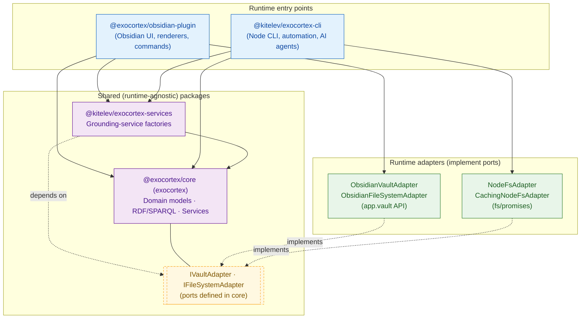

# Exocortex

**A semantic knowledge management system built on RDF, SPARQL, and ontology-driven architecture. Runs as an Obsidian plugin, CLI tool, or TypeScript library.**

[](./LICENSE)
[](https://github.com/kitelev/exocortex/actions/workflows/ci.yml)
[](https://github.com/kitelev/exocortex/actions)
[](https://github.com/kitelev/exocortex/actions/workflows/ci.yml)

---

## Why Exocortex

Most tools separate data from configuration: you write content in one place and configure UI, workflows, and schemas in another. Exocortex takes a different approach — **Everything as Knowledge**.

Your entities, their properties, UI layouts, workflows, and commands are all described as semantic data in the same Markdown files, in the same vault. Create a new entity type — and the UI adapts automatically. Define a workflow transition — and buttons appear. No code changes, no server, no vendor lock-in.

This is an evolution of the "as Code" paradigm (Infrastructure as Code, Docs as Code):

| As Code                                  | As Knowledge (Exocortex)                                                                       |
| ---------------------------------------- | ---------------------------------------------------------------------------------------------- |
| **Workflow as Code** — CI/CD pipelines   | **Workflow as Knowledge** — status transitions as RDF data, UI buttons generated automatically |
| **Layout as Code** — JSON/CSS config     | **Layout as Knowledge** — columns, filters, sorting described semantically                     |
| **Schema as Code** — JSON Schema, Prisma | **Schema as Knowledge** — OWL classes and properties as files in your vault                    |

**"As Code" describes desired system state. "As Knowledge" describes what things mean and how they relate.**

Compared to existing tools:

|                           | Exocortex | Notion | Jira | Semantic MediaWiki | Protégé |
| ------------------------- | :-------: | :----: | :--: | :----------------: | :-----: |
| RDF/Semantic              |    ✅     |   —    |  —   |         ✅         |   ✅    |
| File-based (git-friendly) |    ✅     |   —    |  —   |         —          |   ✅    |
| UI from ontology          |    ✅     |   ✅   |  ~   |         ~          |   ✅    |
| Offline-first             |    ✅     |   ~    |  —   |         —          |   ✅    |
| For knowledge workers     |    ✅     |   ✅   |  ✅  |         ~          |   ��    |
| Action layer (commands)   |    ✅     |   ~    |  ✅  |         —          |    —    |

---

## What It Does

- **Semantic knowledge graph** — every piece of knowledge is an Asset with UUID, class, properties, and relationships stored as RDF triples
- **SPARQL queries** — ask complex questions across your entire knowledge base
- **Modular ontologies** — IMS (concepts, notes, people), EMS (tasks, projects, meetings), ZTLK (zettelkasten)
- **Everything as Knowledge** — commands, workflows, property schemas, layouts, and even plugin settings (`exo__Setting` assets — see [docs/settings-homoiconization.md](./docs/settings-homoiconization.md)) defined as vault assets, not hardcoded
- **Ontology plugins** — extend the system with installable ontology packages (e.g. [GTD + Jedi Techniques](https://github.com/kitelev/gtd-jedi))
- **Profile** (production-ready) — vault-declared homoiconic profiles that drive on-disk AssetSpace materialization via a single **Apply profile** operation (mount-state strict replace). One vault, multiple contexts, selective sync. See [docs/profile.md](./docs/profile.md).
- **ExoSync** — GitHub-backed vault sync via the **Exocortex: Sync** command: pull → merge → push over the GitHub REST API, with structured 3-way merge and quarantine for unresolvable conflicts (a SHACL merge-gate ships in core but is not yet wired into the plugin). Works on mobile (no git binary required). See [docs/exosync.md](./docs/exosync.md).
- **UI/CLI Parity** — every capability is reachable from the Obsidian plugin and the CLI; neither client holds exclusive features. The complement of homoiconicity: it keeps the _invocation_ layer open just as homoiconicity keeps the _data_ layer open. See [VISION.md](./VISION.md#uicli-parity-invariant).
- **Local-first** — all data stays on your device, no cloud required

---

## Quick Start

### Option 1: Obsidian Plugin (via BRAT)

Best for: Visual knowledge management, daily planning, interactive exploration.

**Prerequisites:**

- **Obsidian** 1.4+

**Install Exocortex via BRAT:**

1. Install [BRAT](https://github.com/TfTHacker/obsidian42-brat) plugin from Obsidian Community Plugins
2. Open BRAT settings → **Add Beta Plugin**
3. Enter repository: `kitelev/exocortex`
4. Click **Add Plugin** and enable Exocortex in Community plugins

BRAT will automatically keep the plugin updated with new releases.

> **Next:** Follow the **[Getting Started Guide](./docs/Getting-Started.md)** to bootstrap your vault and create your first Area, Project, and Task.
>
> **Note:** Layouts appear in **Reading Mode** (Ctrl/Cmd + E).

### Option 2: CLI

Best for: Automation, AI agents, batch operations.

The CLI exposes five core verbs — `find`, `apply`, `query`, `index`, `validate` — plus auxiliary commands (`ask`, `classes`, `create`, `archive`, `workflow`, and more).

```bash
# Run via npx (or npm install -g @kitelev/exocortex-cli)

# Query your knowledge graph
npx @kitelev/exocortex-cli query "
PREFIX exo: <https://exocortex.my/ontology/exo#>
PREFIX ems: <https://exocortex.my/ontology/ems#>
SELECT ?task ?label WHERE {
  ?task exo:Instance_class ems:Task .
  ?task exo:Asset_label ?label
}" --vault ~/vault

# Apply a vault-defined command (exocmd__Command) to an asset —
# e.g. a status-transition command that completes a task.
# <cmd> is the command's UUID or its exocmd__Command_cliName slug.
npx @kitelev/exocortex-cli apply <cmd> "tasks/my-task.md" --vault ~/vault --dry-run
```

### Option 3: Core Library

Best for: Building custom applications.

```typescript
import { InMemoryTripleStore, Triple, IRI, Literal } from "exocortex";

const store = new InMemoryTripleStore();
await store.add(
  new Triple(
    new IRI("obsidian://vault/tasks/my-task.md"),
    new IRI("https://exocortex.my/ontology/exo#Asset_label"),
    new Literal("My first task"),
  ),
);

// match(subject?, predicate?, object?) — undefined acts as a wildcard
const labels = await store.match(
  undefined,
  new IRI("https://exocortex.my/ontology/exo#Asset_label"),
  undefined,
);
console.log(labels.map((t) => t.object.toString()));
```

See the **[Core API Reference](./docs/api/Core-API.md)** for the full TypeScript API, including the SPARQL engine and vault-to-RDF conversion services.

---

## Key Features

### Asset — The Unit of Knowledge

Every piece of knowledge is a Markdown file with YAML frontmatter:

```yaml
---
exo__Asset_uid: 965fd5c2-808e-4c7e-8242-e2e5d85bd996
exo__Instance_class:
  - "[[ims__Concept]]"
exo__Asset_label: "Exocortex"
exo__Asset_relates:
  - "[[PKM]]"
  - "[[Semantic Web]]"
---
Knowledge content in Markdown...
```

Assets are connected through typed relationships. Individual assets are information; connected assets become knowledge.

### SPARQL Queries

Ask complex questions about your knowledge:

```sparql
# Find all tasks related to a specific concept
PREFIX exo: <https://exocortex.my/ontology/exo#>
PREFIX ems: <https://exocortex.my/ontology/ems#>
SELECT ?task ?label WHERE {
  ?task exo:Instance_class ems:Task .
  ?task exo:Asset_label ?label .
  ?task exo:Asset_relates ?concept .
  ?concept exo:Asset_label "Machine Learning" .
}
```

### Effort Lifecycle

Complete workflow from idea to completion with automatic timestamp tracking:

```
Draft → Backlog → Analysis → ToDo → Doing → Done
                     ↓
                  Trashed
```

### Workflow Customization

Define custom status lifecycles for your tasks and projects — all using regular vault assets:

```bash
exocortex-cli workflow list --vault ~/vault
exocortex-cli workflow validate <uid> --vault ~/vault
```

See **[Workflow Customization Guide](./docs/WORKFLOW_CUSTOMIZATION.md)** for details.

### Ontology-Driven Forms

Create assets with forms generated from your RDF ontology — fields appear based on `rdfs:domain`, types detected from `rdfs:range`.

### Layout Code Blocks

Embed Layout definitions directly in your notes:

````markdown
```exo-layout
[[emslayout__UpcomingTasksLayout]]
```
````

Features: wikilink syntax, loading state, error handling, auto-refresh, interactive sortable tables with inline editing.

### Ontology Plugins

Install community ontology packages (AssetSpaces) to extend your knowledge graph:

- **CLI:** `npx @kitelev/exocortex-cli assetspace-add --vault ~/vault --url https://github.com/kitelev/exoas-pmbok-ontology` adds a single AssetSpace from a public GitHub URL; `bootstrap` sets up a fresh vault with the SDK floor.
- **Plugin:** the **Add assetspace by URL** and **Bootstrap vault** palette commands do the same from Obsidian.

### Profile — Vault-Declared Context

**Production-ready.** Profile is the architectural cornerstone that makes Exocortex genuinely multi-context: one vault, many roles, full privacy/perf isolation per role.

A profile is a regular vault asset (`exo__Profile`) that declares which AssetSpaces (ontology submodule packages) are active. There is a single operation over it:

- **Apply profile** (`Exocortex: Apply profile`) — a 2-phase-commit, mount-state strict replace. Materializes the profile's effective AssetSpaces (restore from cache or re-pull from GitHub), unmounts the rest; the TS-floor (`exo`) is never unmounted, while `exocmd` and `shared-identities` are optional AssetSpaces. Eliminates the iPhone Obsidian Sync reindex storm; gives a physical privacy boundary between work / personal / reading contexts.

`exo__AssetSpace_materialized` is a runtime-derived property that reflects current on-disk state in SPARQL and the inline ✅/⏸ badge on AssetSpace pages.

See [docs/profile.md](./docs/profile.md) for the full architectural pitch, including the UID-canon privacy model.

### Command Palette

Statically registered plugin commands (all prefixed `Exocortex:` in the palette):

| Command                            | Description                                                                                                                                |
| ---------------------------------- | ------------------------------------------------------------------------------------------------------------------------------------------ |
| **Create asset**                   | Create a new asset via an ontology-driven form                                                                                              |
| **edit properties**                | Edit the active asset's frontmatter properties                                                                                              |
| **Reload layout**                  | Re-render the layout on the active asset                                                                                                    |
| **Toggle layout visibility**       | Show or hide layouts in Reading Mode                                                                                                        |
| **Toggle archived assets visibility** | Show or hide archived assets in layout tables                                                                                            |
| **open sparql query builder**      | Open the interactive SPARQL query builder                                                                                                   |
| **Apply profile**                  | Apply a vault-declared profile — mount-state strict replace of the AssetSpace set (available when filesystem materialization is wired: desktop git, or mobile REST) |
| **Sync**                           | ExoSync: pull → merge → push the materialized AssetSpace set over the GitHub REST API                                                       |
| **Bootstrap vault**                | Fetch tracked AssetSpaces into a vault (desktop)                                                                                            |
| **Add assetspace by URL**          | Add an AssetSpace from a public GitHub repository (desktop)                                                                                 |
| **Push current assetspace**        | Push the AssetSpace containing the active file to its remote                                                                                |
| **Show current state**             | Report the last-applied profile                                                                                                             |
| **Clear switch cache (wipe-all)**  | Clear the profile-switch tarball cache                                                                                                      |

In addition, vault-defined `exocmd__Command` assets are registered **dynamically** as palette commands (the homoiconic command layer) — their set depends on the commands declared in your vault, with visibility gated by their preconditions.

---

## Architecture

Monorepo with packages sharing a Clean Architecture core. Two runtime entry points (Obsidian Plugin and CLI) both depend on the same domain core and shared grounding-service factories; runtime-specific adapters implement common storage interfaces (`IVaultAdapter` / `IFileSystemAdapter`) so domain logic stays runtime-agnostic.



### Packages

| Package                         | npm                      | Purpose                                                                     |
| ------------------------------- | ------------------------ | --------------------------------------------------------------------------- |
| **exocortex**                   | Private                  | Core business logic, domain models, SPARQL engine, 35+ services             |
| **@exocortex/obsidian-plugin**  | Private                  | Interactive UI: React components, layout renderers, palette commands, modals |
| **@kitelev/exocortex-cli**      | `@kitelev/exocortex-cli` | CLI for automation, archive/unarchive, SPARQL queries, AI agent integration |
| **@kitelev/exocortex-services** | Private                  | Shared runtime-agnostic grounding-service factories (RFC 94e520da Phase 1)  |
| **@exocortex/test-utils**       | Private                  | Shared test utilities, mock factories, flaky test reporter                  |

### Technical Standards

- **Clean Architecture** — clear layer separation (presentation, application, domain, infrastructure)
- **SOLID Principles** — especially Single Responsibility
- **Domain-Driven Design** — knowledge domain as system center
- **Semantic Web** — RDF, SPARQL 1.2, OWL, RDF-Star
- **Local-first** — your data stays local, cloud is optional

### SPARQL 1.2 Support

| Feature                       | Description                                          |
| ----------------------------- | ---------------------------------------------------- |
| **LATERAL Joins**             | Correlated subqueries for "top N per group" patterns |
| **PREFIX\***                  | Auto-import prefixes from well-known vocabularies    |
| **DESCRIBE Options**          | DEPTH and SYMMETRIC control for DESCRIBE queries     |
| **Directional Language Tags** | RTL/LTR text direction support (`@ar--rtl`)          |
| **DateTime Arithmetic**       | Native date/time subtraction and duration operations |
| **NORMALIZE/FOLD**            | Unicode normalization and case folding               |

---

## Documentation

### Getting Started

- **[Installation Guide](./docs/Getting-Started.md)** — Step-by-step setup

### By Interface

**CLI:**

- Run `npx @kitelev/exocortex-cli --help` for the full list of commands and options (`find`, `apply`, `query`, `index`, `validate`, and more)

**Core Library:**

- **[Core API Reference](./docs/api/Core-API.md)** — TypeScript API
- **[Architecture Guide](./ARCHITECTURE.md)** — Clean Architecture patterns

---

## Development

```bash
git clone https://github.com/kitelev/exocortex
cd exocortex
git submodule update --init --recursive
npm install
npm run build
npm run test:all
```

The `git submodule update --init --recursive` step hydrates `packages/exoas-exo` and `packages/exoas-exocmd` — the TBox ontology + `exocmd__Command` fixture submodules. Tests that read fixture assets from these submodules on disk fail with an explicit error if they are missing (e.g. `grounding-type-vault-fixture-parity.test.ts` walks `packages/exoas-exocmd/`; `VaultSettingsRegistry.test.ts` reads `packages/exoas-exo/exo/`). Both submodules are public; no auth token required.

This project is developed primarily by AI agents (Claude Code, GitHub Copilot) following documented patterns. Human contributions welcome!

### AI Development Resources

| Document                                                         | Purpose                             |
| ---------------------------------------------------------------- | ----------------------------------- |
| **[CLAUDE.md](./CLAUDE.md)**                                     | AI agent guidelines, worktree rules |
| **[AI Development Patterns](./docs/AI-DEVELOPMENT-PATTERNS.md)** | Lessons from 1500+ completed issues |
| **[Architecture Guide](./ARCHITECTURE.md)**                      | Clean Architecture patterns         |

---

## Vision

For the full philosophical vision, long-term roadmap, and 42 unique IT ideas behind the project, see **[VISION.md](./VISION.md)**.

---

## License

MIT License — see [LICENSE](./LICENSE)
